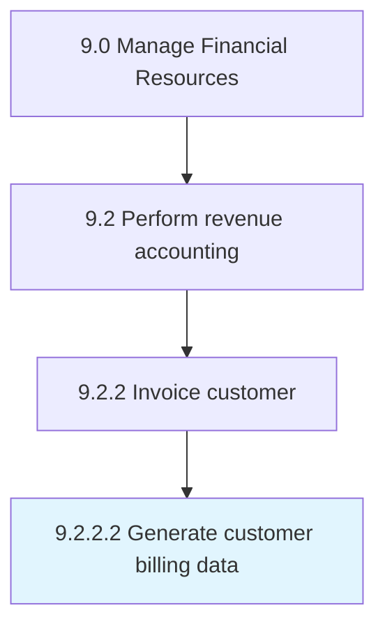

# Generate customer billing data

> Preparing detailed reports about products purchased by customers.

## Overview

Activity 9.2.2.2 is an activity within the Manage Financial Resources framework. 

Preparing detailed reports about products purchased by customers. Record and generate a detail account of transactions made by customers fat a particular time and location. Include all details about products such as price, quantity, and name.

## Process Hierarchy



## Key Statistics

| Metric | Value |
|--------|-------|
| APQC Code | 10795 |
| Hierarchy ID | 9.2.2.2 |
| Level | Activity |
| Parent | [9.2.2](../) |
| Sub-Processes | 0 |


## GraphDL Semantic Structure

```
generate.CustomerBillingData
```

| Component | Value | Description |
|-----------|-------|-------------|
| Verb | `generate` | Primary action |
| Object | `customer billing data` | Direct object |


## Related Concepts

- CustomerBillingData


---

*Source: APQC PCF 10795 (9.2.2.2) - APQC*
