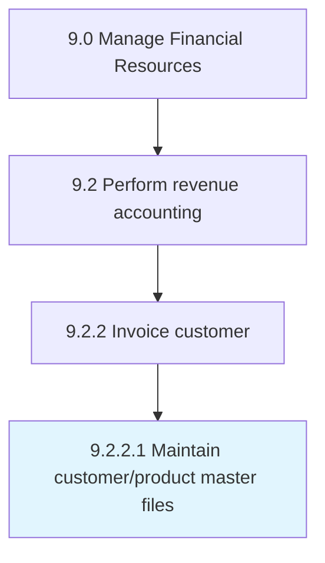

# Maintain customer/product master files

> Creating and updating a record of customers and the products being purchased by them in a database.

## Overview

Activity 9.2.2.1 is an activity within the Manage Financial Resources framework. 

Creating and updating a record of customers and the products being purchased by them in a database. This process element requires the organization to maintain a database of customers and their purchases. Such a master-file can be used to ensure customer touch point, enhance customer satisfaction, explore cross selling opportunities, and identify future trends. This database will include several particulars about the personal details of the organization's customers and a tracking of the products being sold.

## Process Hierarchy



## Key Statistics

| Metric | Value |
|--------|-------|
| APQC Code | 10794 |
| Hierarchy ID | 9.2.2.1 |
| Level | Activity |
| Parent | [9.2.2](../) |
| Sub-Processes | 0 |


## GraphDL Semantic Structure

```
maintain.CustomerproductMasterFiles
```

| Component | Value | Description |
|-----------|-------|-------------|
| Verb | `maintain` | Primary action |
| Object | `customer/product master files` | Direct object |


## Related Concepts

- [CustomerMasterFiles](/concepts/CustomerMasterFiles)
- [ProductMasterFiles](/concepts/ProductMasterFiles)


---

*Source: APQC PCF 10794 (9.2.2.1) - APQC*
