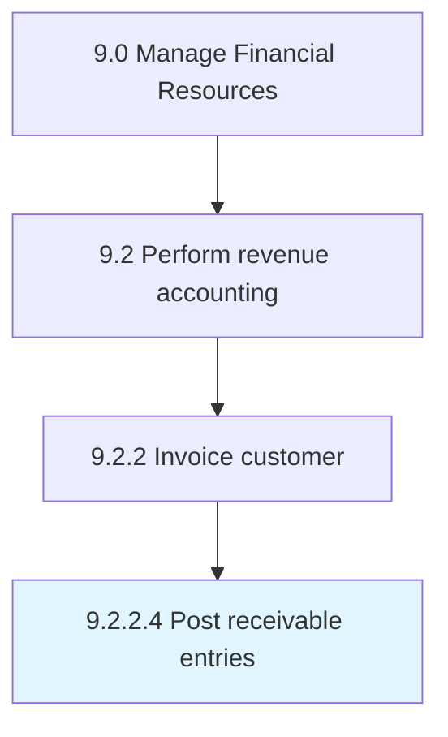

# Post receivable entries

> Registering transactions and their scheduled payments.

## Overview

Activity 9.2.2.4 is an activity within the Manage Financial Resources framework. 

Registering transactions and their scheduled payments.

## Process Hierarchy



## Key Statistics

| Metric | Value |
|--------|-------|
| APQC Code | 10797 |
| Hierarchy ID | 9.2.2.4 |
| Level | Activity |
| Parent | [9.2.2](../) |
| Sub-Processes | 0 |


## GraphDL Semantic Structure

```
post.ReceivableEntries
```

| Component | Value | Description |
|-----------|-------|-------------|
| Verb | `post` | Primary action |
| Object | `receivable entries` | Direct object |


## Related Concepts

- [ReceivableEntries](/concepts/ReceivableEntries)


---

*Source: APQC PCF 10797 (9.2.2.4) - APQC*
