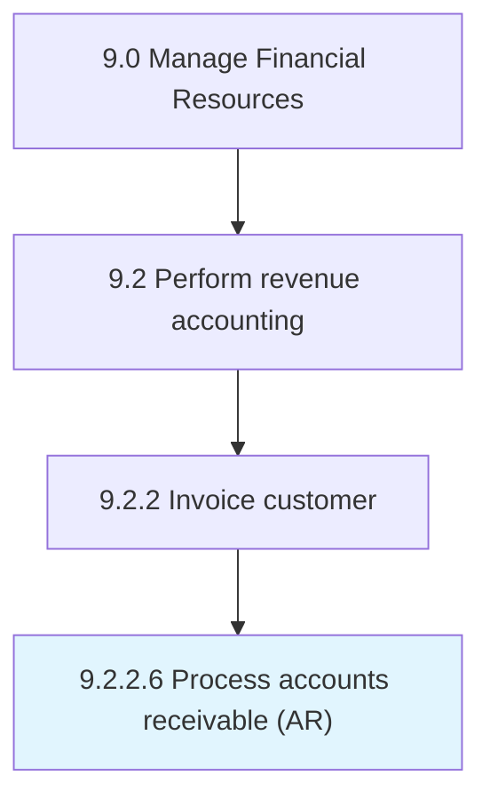

# Process accounts receivable (AR)

> Processing payments due from customers.

## Overview

Activity 9.2.2.6 is an activity within the Manage Financial Resources framework. 

Processing payments due from customers. This includes all processing of funds received, whether by check or electronically. This does not include the generation of invoices.

## Process Hierarchy



## Key Statistics

| Metric | Value |
|--------|-------|
| APQC Code | 10744 |
| Hierarchy ID | 9.2.2.6 |
| Level | Activity |
| Parent | [9.2.2](../) |
| Sub-Processes | 0 |


## GraphDL Semantic Structure

```
process.AccountsReceivableAR
```

| Component | Value | Description |
|-----------|-------|-------------|
| Verb | `process` | Primary action |
| Object | `accounts receivable (AR)` | Direct object |


---

*Source: APQC PCF 10744 (9.2.2.6) - APQC*
