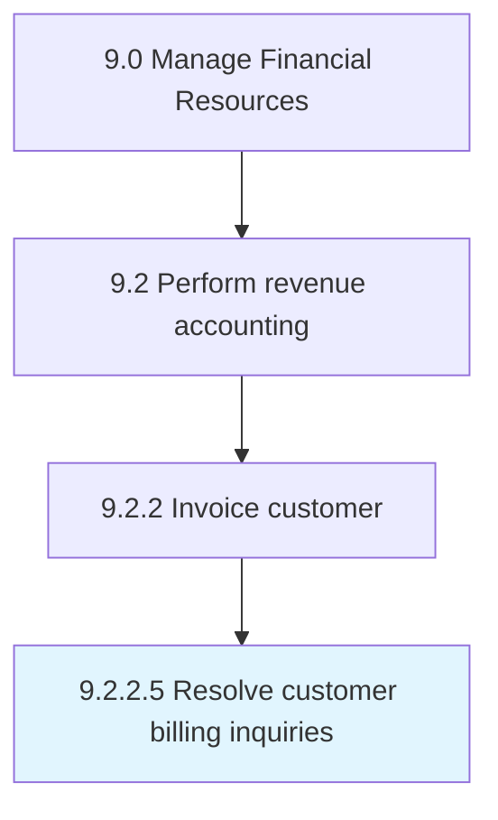

# Resolve customer billing inquiries

> Checking and solving billing queries raised by customers.

## Overview

Activity 9.2.2.5 is an activity within the Manage Financial Resources framework. 

Checking and solving billing queries raised by customers.

## Process Hierarchy



## Key Statistics

| Metric | Value |
|--------|-------|
| APQC Code | 10798 |
| Hierarchy ID | 9.2.2.5 |
| Level | Activity |
| Parent | [9.2.2](../) |
| Sub-Processes | 0 |


## GraphDL Semantic Structure

```
resolve.CustomerBillingInquiries
```

| Component | Value | Description |
|-----------|-------|-------------|
| Verb | `resolve` | Primary action |
| Object | `customer billing inquiries` | Direct object |


## Related Concepts

- [CustomerBillingInquiries](/concepts/CustomerBillingInquiries)


---

*Source: APQC PCF 10798 (9.2.2.5) - APQC*
