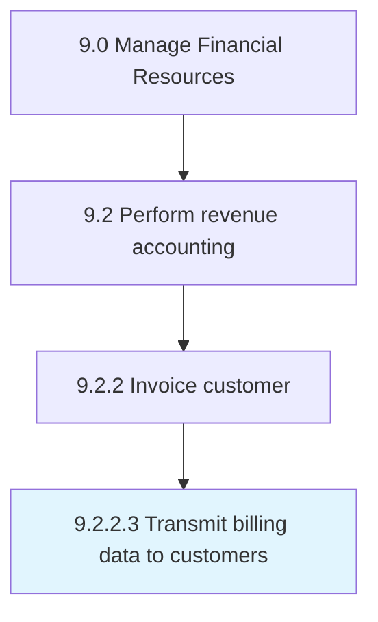

# Transmit billing data to customers

> Providing information to customers about purchases made by them.

## Overview

Activity 9.2.2.3 is an activity within the Manage Financial Resources framework. 

Providing information to customers about purchases made by them. Communicate the details of purchases. Provide customers with a copy of details for their reference.

## Process Hierarchy



## Key Statistics

| Metric | Value |
|--------|-------|
| APQC Code | 10796 |
| Hierarchy ID | 9.2.2.3 |
| Level | Activity |
| Parent | [9.2.2](../) |
| Sub-Processes | 0 |


## GraphDL Semantic Structure

```
transmit.BillingData.to.Customers
```

| Component | Value | Description |
|-----------|-------|-------------|
| Verb | `transmit` | Primary action |
| Object | `billing data` | Direct object |
| Preposition | `to` | Relationship |
| PrepObject | `customers` | Indirect object |


## Related Concepts

- BillingData
- Customers


---

*Source: APQC PCF 10796 (9.2.2.3) - APQC*
