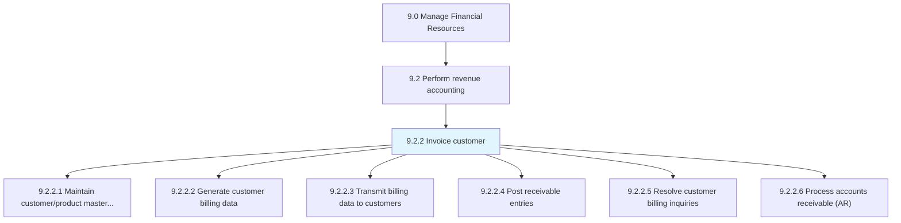
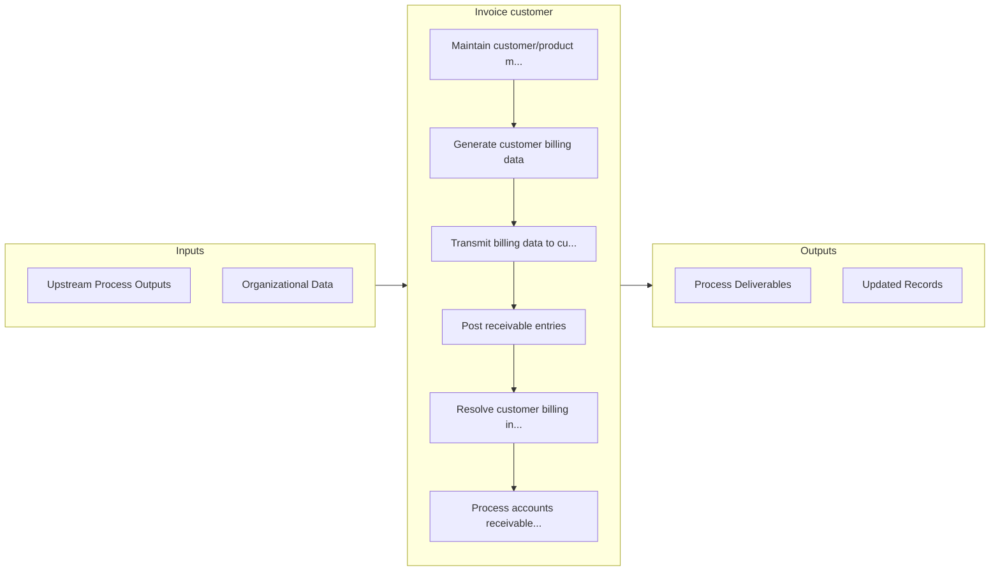

# Invoice customer

> Preparing detailed reports of customer purchases.

## Overview

Process 9.2.2 is a core process that defines the specific procedures for invoice customer. 

Preparing detailed reports of customer purchases. Prepare a commercial document between the seller and customer with details about transaction. Detail the quantity purchased, price of products/services, date, parties involved, unique invoice number, and tax information.

## Process Hierarchy



## Key Statistics

| Metric | Value |
|--------|-------|
| APQC Code | 10743 |
| Hierarchy ID | 9.2.2 |
| Level | Process |
| Parent | [9.2](../) |
| Sub-Processes | 6 |


## GraphDL Semantic Structure

```graphdl
invoice.Customer
```

| Component | Value | Description |
|-----------|-------|-------------|
| Verb | `invoice` | Primary action |
| Object | `customer` | Direct object |


## Process Flow



## Sub-Processes

| Process | Hierarchy ID | Description |
|---------|-------------|-------------|
| [Maintain customer/product master files](./MaintainCustomerproductMasterFiles) | 9.2.2.1 | Creating and updating a record of customers and the products being purchased by them in a database |
| [Generate customer billing data](./GenerateCustomerBillingData) | 9.2.2.2 | Preparing detailed reports about products purchased by customers |
| [Transmit billing data to customers](./TransmitBillingDataToCustomers) | 9.2.2.3 | Providing information to customers about purchases made by them |
| [Post receivable entries](./PostReceivableEntries) | 9.2.2.4 | Registering transactions and their scheduled payments |
| [Resolve customer billing inquiries](./ResolveCustomerBillingInquiries) | 9.2.2.5 | Checking and solving billing queries raised by customers |
| [Process accounts receivable (AR)](./ProcessAccountsReceivableAR) | 9.2.2.6 | Processing payments due from customers |


## Related Concepts

- Customer


---

*Source: APQC PCF 10743 (9.2.2) - APQC*
