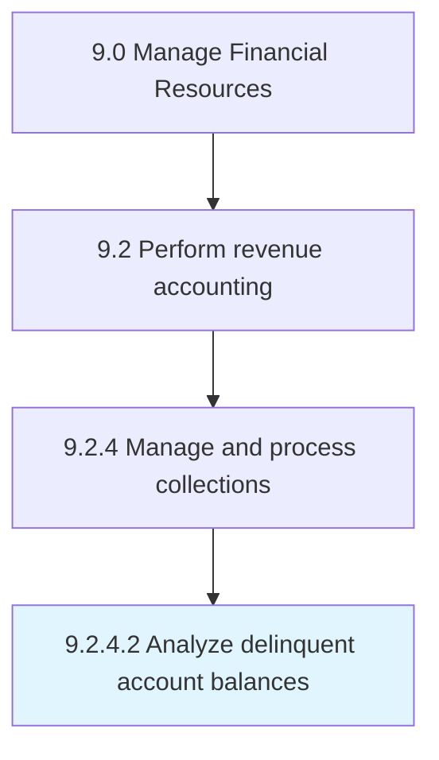

# Analyze delinquent account balances

> Examining balance statements of accountholders who failed to make required payments.

## Overview

Activity 9.2.4.2 is an activity within the Manage Financial Resources framework. 

Examining balance statements of accountholders who failed to make required payments. Study or review the account details of customers' past payments when preparing negotiations policies.

## Process Hierarchy



## Key Statistics

| Metric | Value |
|--------|-------|
| APQC Code | 10805 |
| Hierarchy ID | 9.2.4.2 |
| Level | Activity |
| Parent | [9.2.4](../) |
| Sub-Processes | 0 |


## GraphDL Semantic Structure

```
analyze.DelinquentAccountBalances
```

| Component | Value | Description |
|-----------|-------|-------------|
| Verb | `analyze` | Primary action |
| Object | `delinquent account balances` | Direct object |


## Related Concepts

- [DelinquentAccountBalances](/concepts/DelinquentAccountBalances)


---

*Source: APQC PCF 10805 (9.2.4.2) - APQC*
