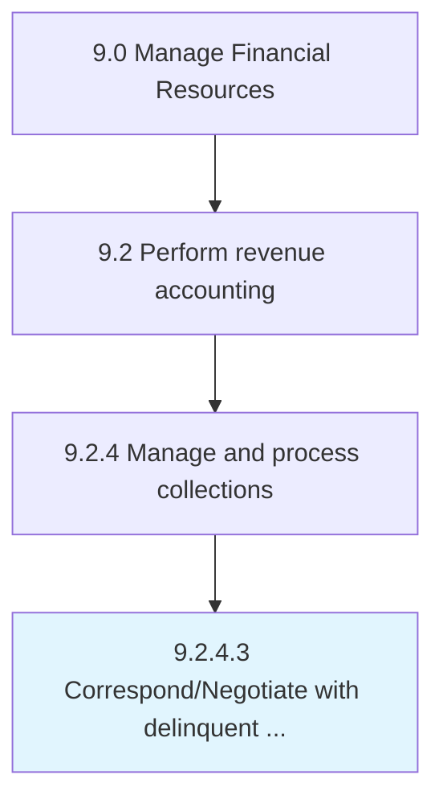

# Correspond/Negotiate with delinquent accounts

> Determine ways for customers in default to repay debts (e.

## Overview

Activity 9.2.4.3 is an activity within the Manage Financial Resources framework. 

Determine ways for customers in default to repay debts (e.g., allowing more time or discounts).

## Process Hierarchy



## Key Statistics

| Metric | Value |
|--------|-------|
| APQC Code | 10806 |
| Hierarchy ID | 9.2.4.3 |
| Level | Activity |
| Parent | [9.2.4](../) |
| Sub-Processes | 0 |


## GraphDL Semantic Structure

```
correspond/negotiate.WithDelinquentAccounts
```

| Component | Value | Description |
|-----------|-------|-------------|
| Verb | `correspond/negotiate` | Primary action |
| Object | `with delinquent accounts` | Direct object |


## Related Concepts

- DelinquentAccounts
- DelinquentAccounts


---

*Source: APQC PCF 10806 (9.2.4.3) - APQC*
