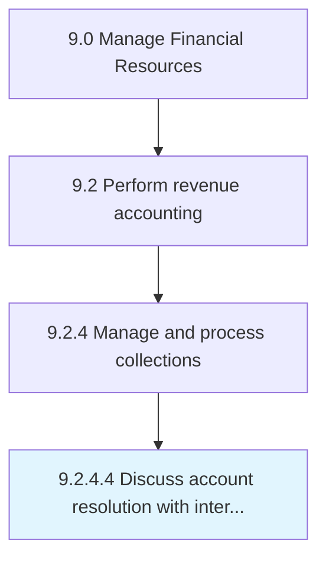

# Discuss account resolution with internal parties

> Determining rules for handling accounts.

## Overview

Activity 9.2.4.4 is an activity within the Manage Financial Resources framework. 

Determining rules for handling accounts. Discuss and plan with internal parties (department heads, managers, and senior management) about rules to follow in coming months.

## Process Hierarchy



## Key Statistics

| Metric | Value |
|--------|-------|
| APQC Code | 10807 |
| Hierarchy ID | 9.2.4.4 |
| Level | Activity |
| Parent | [9.2.4](../) |
| Sub-Processes | 0 |


## GraphDL Semantic Structure

```
discuss.AccountResolution.with.InternalParties
```

| Component | Value | Description |
|-----------|-------|-------------|
| Verb | `discuss` | Primary action |
| Object | `account resolution` | Direct object |
| Preposition | `with` | Relationship |
| PrepObject | `internal parties` | Indirect object |


## Related Concepts

- [AccountResolution](/concepts/AccountResolution)
- [InternalParties](/concepts/InternalParties)


---

*Source: APQC PCF 10807 (9.2.4.4) - APQC*
