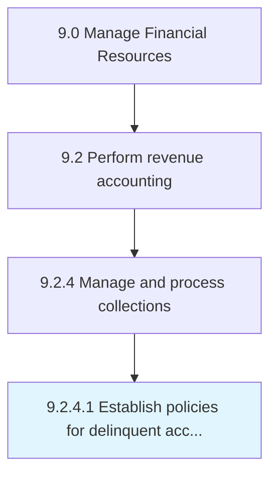

# Establish policies for delinquent accounts

> Creating a process to follow in case of a failed payment by account holders.

## Overview

Activity 9.2.4.1 is an activity within the Manage Financial Resources framework. 

Creating a process to follow in case of a failed payment by account holders. Create rules and regulations for the account holder who has failed to make at least the minimum monthly payment by the due date.

## Process Hierarchy



## Key Statistics

| Metric | Value |
|--------|-------|
| APQC Code | 10804 |
| Hierarchy ID | 9.2.4.1 |
| Level | Activity |
| Parent | [9.2.4](../) |
| Sub-Processes | 0 |


## GraphDL Semantic Structure

```
establish.Policies.for.DelinquentAccounts
```

| Component | Value | Description |
|-----------|-------|-------------|
| Verb | `establish` | Primary action |
| Object | `policies` | Direct object |
| Preposition | `for` | Relationship |
| PrepObject | `delinquent accounts` | Indirect object |


## Related Concepts

- Policies
- DelinquentAccounts


---

*Source: APQC PCF 10804 (9.2.4.1) - APQC*
