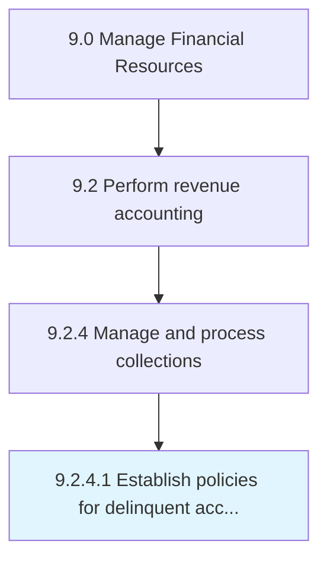
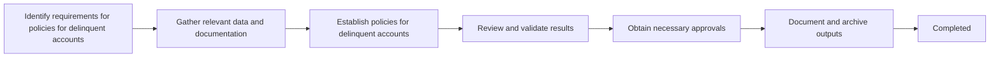

# Establish policies for delinquent accounts

> Creating a process to follow in case of a failed payment by account holders.

## Overview

Activity 9.2.4.1 is an activity within the Revenue Accounting domain of the Manage Financial Resources framework.

Creating a process to follow in case of a failed payment by account holders. This activity plays a critical role in ensuring that the organization maintains sound financial governance, operational efficiency, and regulatory compliance. It supports upstream planning and downstream execution by providing structured outputs that inform decision-making across finance and business operations. Effective execution of this activity requires coordination among finance professionals, process owners, and leadership stakeholders to ensure accuracy, timeliness, and alignment with organizational objectives.

## Process Hierarchy



## Process Flow



## Key Statistics

| Metric | Value |
|--------|-------|
| APQC Code | 10804 |
| Hierarchy ID | 9.2.4.1 |
| Level | Activity |
| Parent | [9.2.4](../) |
| Sub-Processes | 0 |

## GraphDL Semantic Structure

```graphdl
establish.Policies.for.DelinquentAccounts
```

| Component | Value | Description |
|-----------|-------|-------------|
| Verb | `establish` | Primary action |
| Object | `policies` | Direct object |
| Preposition | `for` | Relationship |
| PrepObject | `delinquent accounts` | Indirect object |

## RACI Matrix

| Activity | Responsible | Accountable | Consulted | Informed |
|----------|-------------|-------------|-----------|----------|
| Record revenue transactions | Revenue Accountant | Revenue Manager | Sales Operations | Controller |
| Review recognition | Revenue Manager | Controller | External Auditors | CFO |
| Manage receivables | AR Specialist | AR Manager | Sales Team | Revenue Manager |

## Related Occupations

- [Financial Managers](/occupations/Management/FinancialManagers)
- [Accountants and Auditors](/occupations/Business/Financial/AccountantsAndAuditors)
- [Billing and Posting Clerks](/occupations/Administrative/BillingAndPostingClerks)
- [Credit Analysts](/occupations/Business/Financial/CreditAnalysts)
- [Financial Analysts](/occupations/Business/Financial/FinancialAnalysts)

## Related Departments

- Revenue Accounting
- Sales Operations
- Finance & Accounting

## Industry Variations

### Retail

Revenue recognition spans point-of-sale, e-commerce, gift cards, and loyalty programs with complex return and refund provisions.

### SaaS / Technology

Follows ASC 606 for subscription revenue, recognizing revenue ratably over contract terms with multi-element arrangements.

### Construction

Uses percentage-of-completion or completed-contract methods with milestone-based billing and retention accounting.

## KPIs & Metrics

| Metric | Description | Target |
|--------|-------------|--------|
| Days Sales Outstanding (DSO) | Average days to collect receivables | < 35 days |
| Revenue Recognition Accuracy | Percentage of revenue correctly recognized | > 99.5% |
| Billing Error Rate | Percentage of invoices with errors | < 0.5% |
| Credit Memo Volume | Number of credit adjustments issued | Declining trend |

## Related Concepts

- Policies
- DelinquentAccounts

---

*Source: APQC PCF 10804 (9.2.4.1) - APQC*