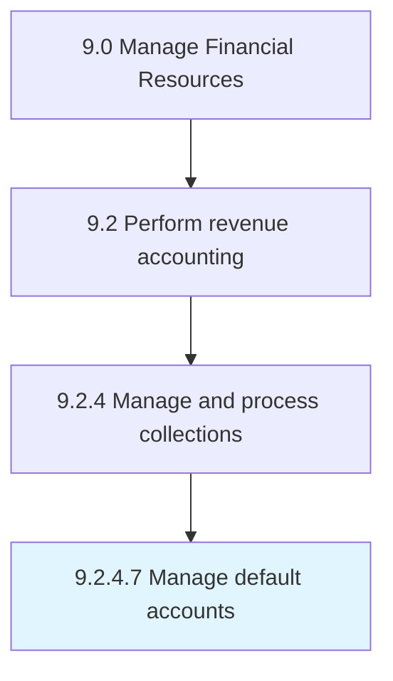

# Manage default accounts

> Managing accounts that have not met the requirements agreed upon to pay off outstanding debts.

## Overview

Activity 9.2.4.7 is an activity within the Manage Financial Resources framework. 

Managing accounts that have not met the requirements agreed upon to pay off outstanding debts.

## Process Hierarchy



## Key Statistics

| Metric | Value |
|--------|-------|
| APQC Code | 14008 |
| Hierarchy ID | 9.2.4.7 |
| Level | Activity |
| Parent | [9.2.4](../) |
| Sub-Processes | 0 |


## GraphDL Semantic Structure

```
manage.DefaultAccounts
```

| Component | Value | Description |
|-----------|-------|-------------|
| Verb | `manage` | Primary action |
| Object | `default accounts` | Direct object |


## Related Concepts

- DefaultAccounts


---

*Source: APQC PCF 14008 (9.2.4.7) - APQC*
