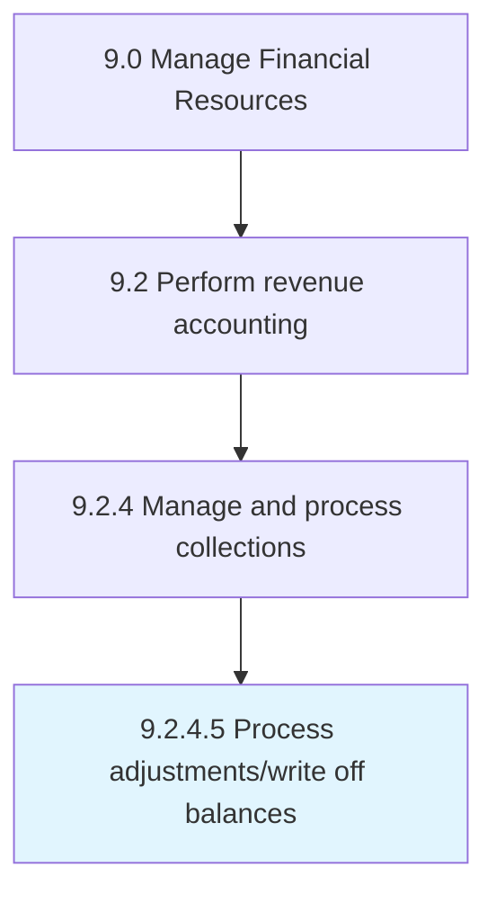

# Process adjustments/write off balances

> Maintaining reserves for write-offs and adjustments.

## Overview

Activity 9.2.4.5 is an activity within the Manage Financial Resources framework. 

Maintaining reserves for write-offs and adjustments. Adjust or write off certain expenses and losses.

## Process Hierarchy



## Key Statistics

| Metric | Value |
|--------|-------|
| APQC Code | 10808 |
| Hierarchy ID | 9.2.4.5 |
| Level | Activity |
| Parent | [9.2.4](../) |
| Sub-Processes | 0 |


## GraphDL Semantic Structure

```
process.AdjustmentswriteOffBalances
```

| Component | Value | Description |
|-----------|-------|-------------|
| Verb | `process` | Primary action |
| Object | `adjustments/write off balances` | Direct object |


## Related Concepts

- [Adjustments](/concepts/Adjustments)
- [Balances](/concepts/Balances)
- [Write](/concepts/Write)
- [Balances](/concepts/Balances)


---

*Source: APQC PCF 10808 (9.2.4.5) - APQC*
