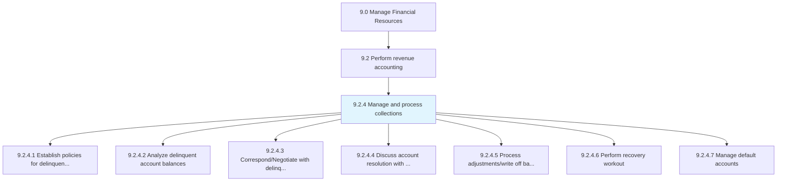
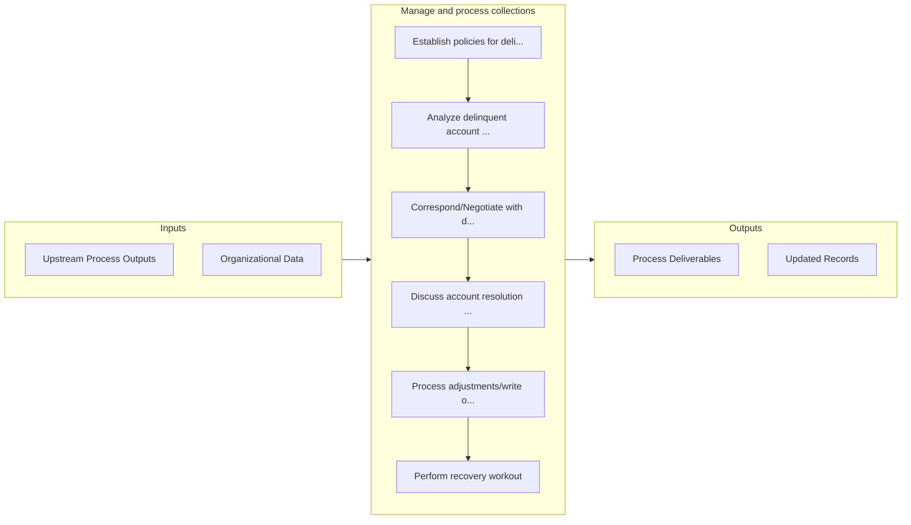

# Manage and process collections

> Posting entries to respective accounts, and preparing accounts for receivables.

## Overview

Process 9.2.4 is a core process that defines the specific procedures for manage and process collections. 

Posting entries to respective accounts, and preparing accounts for receivables. Manage the cash collected by the business from its debtors. Record it in the books of accounts to provide clear information about the availability of the cash.

## Process Hierarchy



## Key Statistics

| Metric | Value |
|--------|-------|
| APQC Code | 10745 |
| Hierarchy ID | 9.2.4 |
| Level | Process |
| Parent | [9.2](../) |
| Sub-Processes | 7 |


## GraphDL Semantic Structure

```
manage.AndProcessCollections
```

| Component | Value | Description |
|-----------|-------|-------------|
| Verb | `manage` | Primary action |
| Object | `and process collections` | Direct object |


## Process Flow



## Sub-Processes

| Process | Hierarchy ID | Description |
|---------|-------------|-------------|
| [Establish policies for delinquent accounts](./EstablishPoliciesForDelinquentAccounts) | 9.2.4.1 | Creating a process to follow in case of a failed payment by account holders |
| [Analyze delinquent account balances](./AnalyzeDelinquentAccountBalances) | 9.2.4.2 | Examining balance statements of accountholders who failed to make required payments |
| [Correspond/Negotiate with delinquent accounts](./CorrespondNegotiateWithDelinquentAccounts) | 9.2.4.3 | Determine ways for customers in default to repay debts (e |
| [Discuss account resolution with internal parties](./DiscussAccountResolutionWithInternalParties) | 9.2.4.4 | Determining rules for handling accounts |
| [Process adjustments/write off balances](./ProcessAdjustmentswriteOffBalances) | 9.2.4.5 | Maintaining reserves for write-offs and adjustments |
| [Perform recovery workout](./PerformRecoveryWorkout) | 9.2.4.6 | Renegotiating the terms of a loan agreement in order to recoup money from a default account |
| [Manage default accounts](./ManageDefaultAccounts) | 9.2.4.7 | Managing accounts that have not met the requirements agreed upon to pay off outstanding debts |


## Related Concepts

- Collections
- Collections


---

*Source: APQC PCF 10745 (9.2.4) - APQC*
