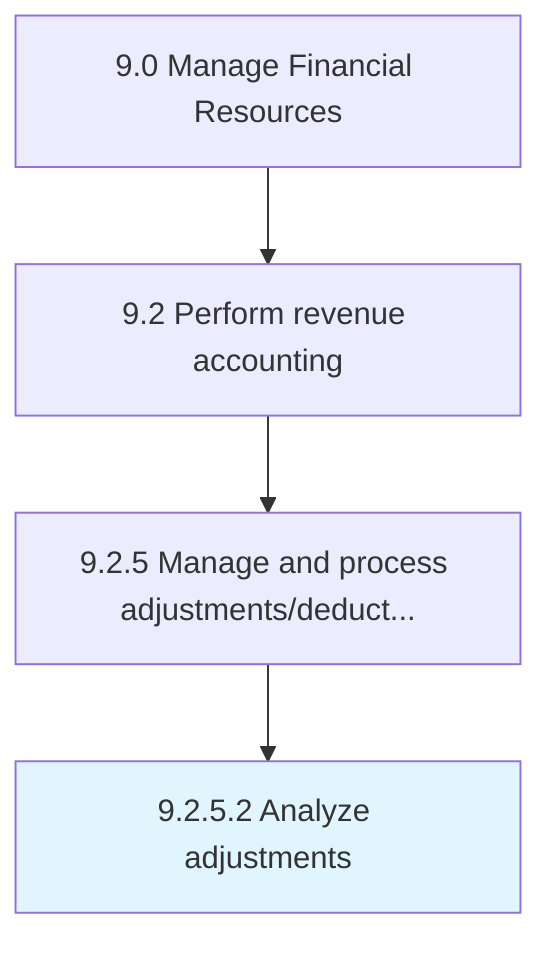

# Analyze adjustments

> Checking changes made in accounts during the year.

## Overview

Activity 9.2.5.2 is an activity within the Manage Financial Resources framework. 

Checking changes made in accounts during the year. Examine the alterations made in final accounts to rectify errors/omissions.

## Process Hierarchy



## Key Statistics

| Metric | Value |
|--------|-------|
| APQC Code | 10810 |
| Hierarchy ID | 9.2.5.2 |
| Level | Activity |
| Parent | [9.2.5](../) |
| Sub-Processes | 0 |


## GraphDL Semantic Structure

```
analyze.Adjustments
```

| Component | Value | Description |
|-----------|-------|-------------|
| Verb | `analyze` | Primary action |
| Object | `adjustments` | Direct object |


## Related Concepts

- [Adjustments](/concepts/Adjustments)


---

*Source: APQC PCF 10810 (9.2.5.2) - APQC*
