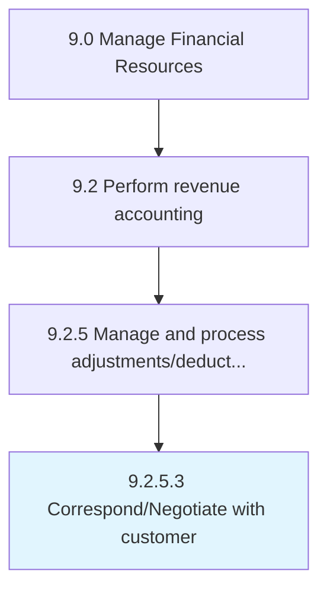

# Correspond/Negotiate with customer

> Providing suitable offers to customers.

## Overview

Activity 9.2.5.3 is an activity within the Manage Financial Resources framework. 

Providing suitable offers to customers. Present different offers (e.g., discounts) available for customers or buyers.

## Process Hierarchy



## Key Statistics

| Metric | Value |
|--------|-------|
| APQC Code | 10811 |
| Hierarchy ID | 9.2.5.3 |
| Level | Activity |
| Parent | [9.2.5](../) |
| Sub-Processes | 0 |


## GraphDL Semantic Structure

```
correspond/negotiate.WithCustomer
```

| Component | Value | Description |
|-----------|-------|-------------|
| Verb | `correspond/negotiate` | Primary action |
| Object | `with customer` | Direct object |


## Related Concepts

- Customer
- Customer


---

*Source: APQC PCF 10811 (9.2.5.3) - APQC*
