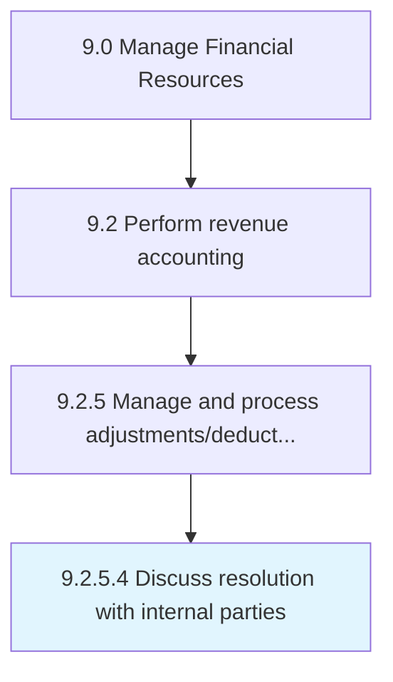

# Discuss resolution with internal parties

> Discussing and planning with internal parties (department heads, managers, and senior management) about rules to follow in coming months.

## Overview

Activity 9.2.5.4 is an activity within the Revenue Accounting domain of the Manage Financial Resources framework.

Discussing and planning with internal parties (department heads, managers, and senior management) about rules to follow in coming months. This activity plays a critical role in ensuring that the organization maintains sound financial governance, operational efficiency, and regulatory compliance. It supports upstream planning and downstream execution by providing structured outputs that inform decision-making across finance and business operations. Effective execution of this activity requires coordination among finance professionals, process owners, and leadership stakeholders to ensure accuracy, timeliness, and alignment with organizational objectives.

## Process Hierarchy



## Process Flow


## Key Statistics

| Metric | Value |
|--------|-------|
| APQC Code | 10812 |
| Hierarchy ID | 9.2.5.4 |
| Level | Activity |
| Parent | [9.2.5](../) |
| Sub-Processes | 0 |

## GraphDL Semantic Structure

```
discuss.Resolution.with.InternalParties
```

| Component | Value | Description |
|-----------|-------|-------------|
| Verb | `discuss` | Primary action |
| Object | `resolution` | Direct object |
| Preposition | `with` | Relationship |
| PrepObject | `internal parties` | Indirect object |

## RACI Matrix

| Activity | Responsible | Accountable | Consulted | Informed |
|----------|-------------|-------------|-----------|----------|
| Record revenue transactions | Revenue Accountant | Revenue Manager | Sales Operations | Controller |
| Review recognition | Revenue Manager | Controller | External Auditors | CFO |
| Manage receivables | AR Specialist | AR Manager | Sales Team | Revenue Manager |

## Related Occupations

- [Financial Managers](/occupations/FinancialManagers)
- [Accountants and Auditors](/occupations/AccountantsAndAuditors)
- [Billing and Posting Clerks](/occupations/BillingAndPostingClerks)
- [Credit Analysts](/occupations/CreditAnalysts)
- [Financial Analysts](/occupations/FinancialAnalysts)

## Related Departments

- Revenue Accounting
- Sales Operations
- Finance & Accounting

## Industry Variations

### Retail

Revenue recognition spans point-of-sale, e-commerce, gift cards, and loyalty programs with complex return and refund provisions.

### SaaS / Technology

Follows ASC 606 for subscription revenue, recognizing revenue ratably over contract terms with multi-element arrangements.

### Construction

Uses percentage-of-completion or completed-contract methods with milestone-based billing and retention accounting.

## KPIs & Metrics

| Metric | Description | Target |
|--------|-------------|--------|
| Days Sales Outstanding (DSO) | Average days to collect receivables | < 35 days |
| Revenue Recognition Accuracy | Percentage of revenue correctly recognized | > 99.5% |
| Billing Error Rate | Percentage of invoices with errors | < 0.5% |
| Credit Memo Volume | Number of credit adjustments issued | Declining trend |

## Related Concepts

- Resolution
- InternalParties

---

*Source: APQC PCF 10812 (9.2.5.4) - APQC*