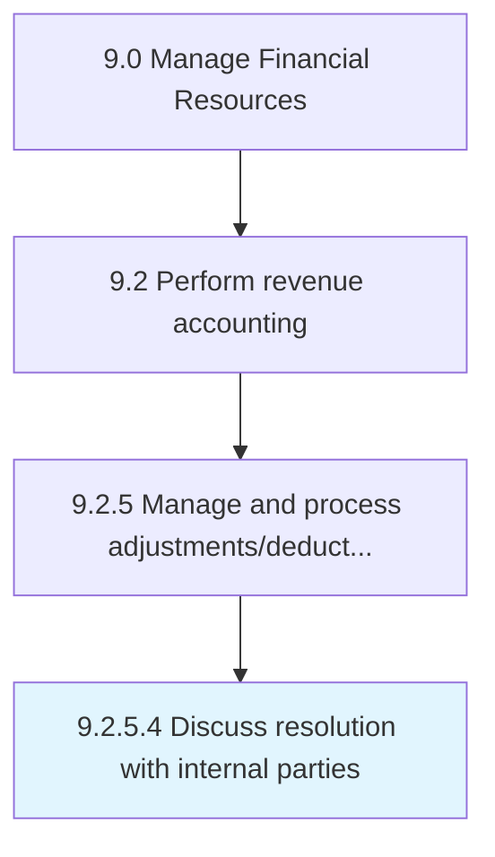

# Discuss resolution with internal parties

> Discussing and planning with internal parties (department heads, managers, and senior management) about rules to follow in coming months.

## Overview

Activity 9.2.5.4 is an activity within the Manage Financial Resources framework. 

Discussing and planning with internal parties (department heads, managers, and senior management) about rules to follow in coming months.

## Process Hierarchy



## Key Statistics

| Metric | Value |
|--------|-------|
| APQC Code | 10812 |
| Hierarchy ID | 9.2.5.4 |
| Level | Activity |
| Parent | [9.2.5](../) |
| Sub-Processes | 0 |


## GraphDL Semantic Structure

```
discuss.Resolution.with.InternalParties
```

| Component | Value | Description |
|-----------|-------|-------------|
| Verb | `discuss` | Primary action |
| Object | `resolution` | Direct object |
| Preposition | `with` | Relationship |
| PrepObject | `internal parties` | Indirect object |


## Related Concepts

- [Resolution](/concepts/Resolution)
- [InternalParties](/concepts/InternalParties)


---

*Source: APQC PCF 10812 (9.2.5.4) - APQC*
