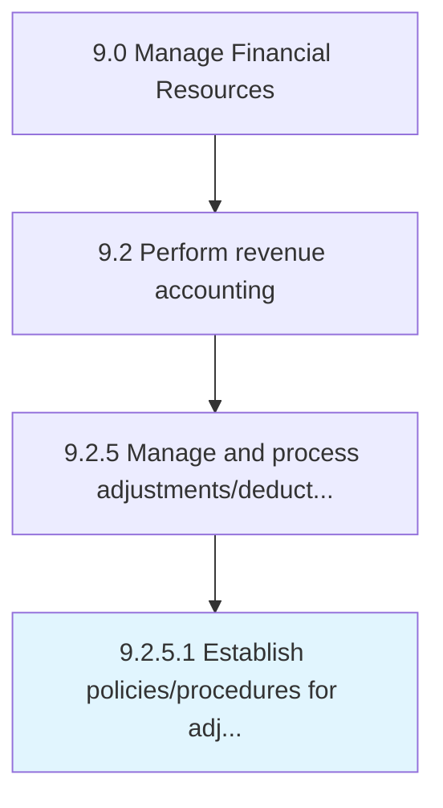

# Establish policies/procedures for adjustments

> Creating guidelines to follow in case of adjustments to business processes.

## Overview

Activity 9.2.5.1 is an activity within the Manage Financial Resources framework. 

Creating guidelines to follow in case of adjustments to business processes.

## Process Hierarchy



## Key Statistics

| Metric | Value |
|--------|-------|
| APQC Code | 10809 |
| Hierarchy ID | 9.2.5.1 |
| Level | Activity |
| Parent | [9.2.5](../) |
| Sub-Processes | 0 |


## GraphDL Semantic Structure

```
establish.Policiesprocedures.for.Adjustments
```

| Component | Value | Description |
|-----------|-------|-------------|
| Verb | `establish` | Primary action |
| Object | `policies/procedures` | Direct object |
| Preposition | `for` | Relationship |
| PrepObject | `adjustments` | Indirect object |


## Related Concepts

- [Policies](/concepts/Policies)
- [Adjustments](/concepts/Adjustments)
- [Procedures](/concepts/Procedures)
- [Adjustments](/concepts/Adjustments)


---

*Source: APQC PCF 10809 (9.2.5.1) - APQC*
