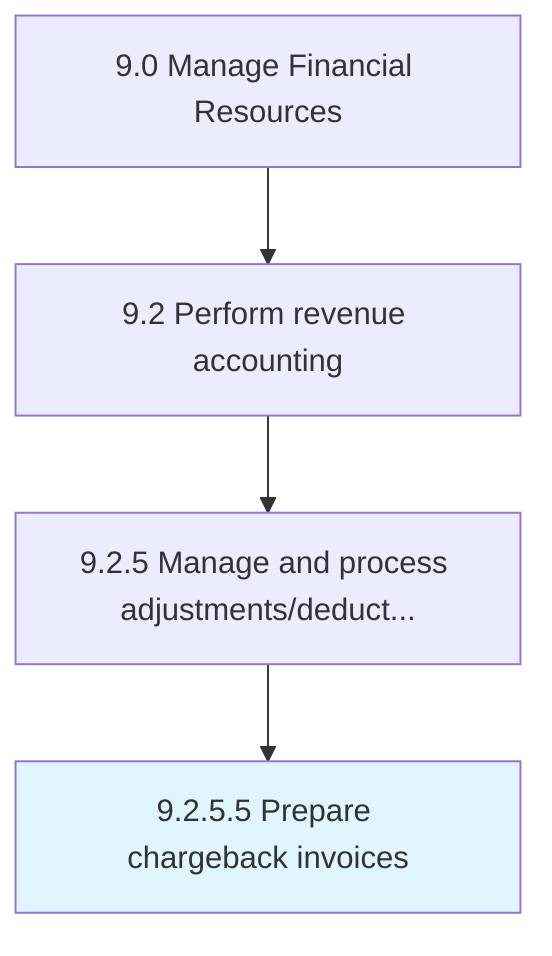

# Prepare chargeback invoices

> Creating a mechanism for consumer protection in case of a higher price charged.

## Overview

Activity 9.2.5.5 is an activity within the Manage Financial Resources framework. 

Creating a mechanism for consumer protection in case of a higher price charged. When a supplier sells a product at a higher price to the distributor than the price they have set with the end user, submit a chargeback to the supplier to recover the money lost in the transaction.

## Process Hierarchy



## Key Statistics

| Metric | Value |
|--------|-------|
| APQC Code | 10813 |
| Hierarchy ID | 9.2.5.5 |
| Level | Activity |
| Parent | [9.2.5](../) |
| Sub-Processes | 0 |


## GraphDL Semantic Structure

```
prepare.ChargebackInvoices
```

| Component | Value | Description |
|-----------|-------|-------------|
| Verb | `prepare` | Primary action |
| Object | `chargeback invoices` | Direct object |


## Related Concepts

- [ChargebackInvoices](/concepts/ChargebackInvoices)


---

*Source: APQC PCF 10813 (9.2.5.5) - APQC*
