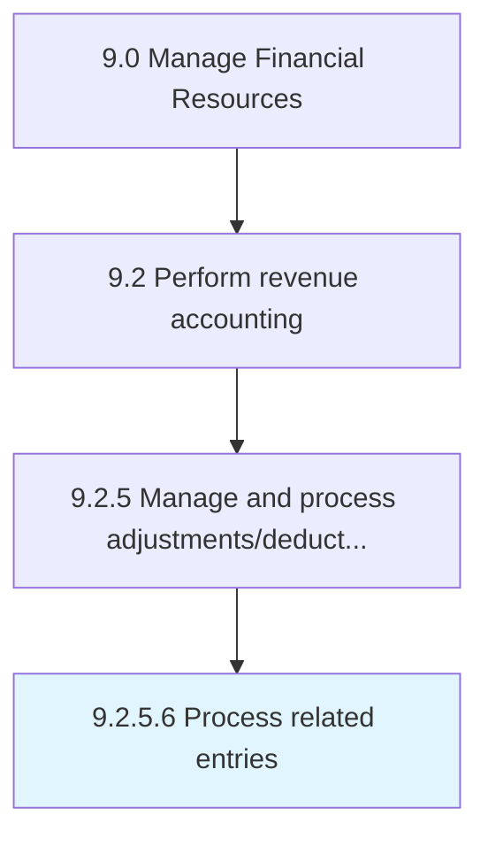

# Process related entries

> Recording business transactions as they occur in order to provide a balanced accounts for financial reporting.

## Overview

Activity 9.2.5.6 is an activity within the Manage Financial Resources framework. 

Recording business transactions as they occur in order to provide a balanced accounts for financial reporting.

## Process Hierarchy



## Key Statistics

| Metric | Value |
|--------|-------|
| APQC Code | 10814 |
| Hierarchy ID | 9.2.5.6 |
| Level | Activity |
| Parent | [9.2.5](../) |
| Sub-Processes | 0 |


## GraphDL Semantic Structure

```
process.RelatedEntries
```

| Component | Value | Description |
|-----------|-------|-------------|
| Verb | `process` | Primary action |
| Object | `related entries` | Direct object |


## Related Concepts

- [RelatedEntries](/concepts/RelatedEntries)


---

*Source: APQC PCF 10814 (9.2.5.6) - APQC*
