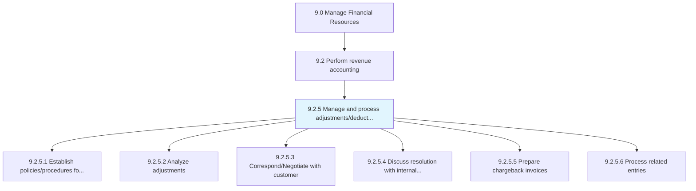
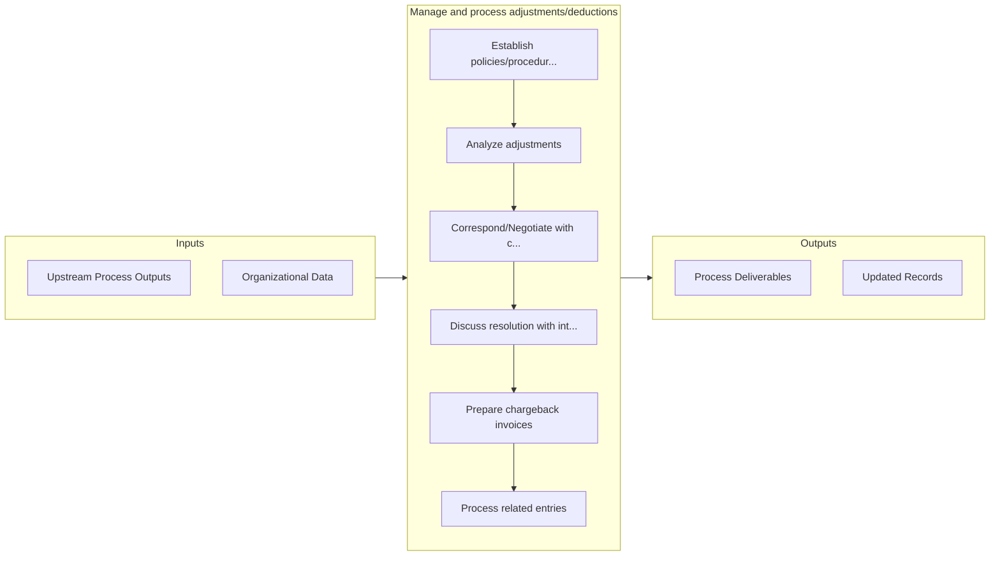

# Manage and process adjustments/deductions

> Creating and providing funds for necessary adjustments and deductions, including all expenses that were required for the business at certain point in time.

## Overview

Process 9.2.5 is a core process that defines the specific procedures for manage and process adjustments/deductions. 

Creating and providing funds for necessary adjustments and deductions, including all expenses that were required for the business at certain point in time.

## Process Hierarchy



## Key Statistics

| Metric | Value |
|--------|-------|
| APQC Code | 10746 |
| Hierarchy ID | 9.2.5 |
| Level | Process |
| Parent | [9.2](../) |
| Sub-Processes | 6 |


## GraphDL Semantic Structure

```
manage.AndProcessAdjustmentsdeductions
```

| Component | Value | Description |
|-----------|-------|-------------|
| Verb | `manage` | Primary action |
| Object | `and process adjustments/deductions` | Direct object |


## Process Flow



## Sub-Processes

| Process | Hierarchy ID | Description |
|---------|-------------|-------------|
| [Establish policies/procedures for adjustments](./EstablishPoliciesproceduresForAdjustments) | 9.2.5.1 | Creating guidelines to follow in case of adjustments to business processes |
| [Analyze adjustments](./AnalyzeAdjustments) | 9.2.5.2 | Checking changes made in accounts during the year |
| [Correspond/Negotiate with customer](./CorrespondNegotiateWithCustomer) | 9.2.5.3 | Providing suitable offers to customers |
| [Discuss resolution with internal parties](./DiscussResolutionWithInternalParties) | 9.2.5.4 | Discussing and planning with internal parties (department heads, managers, and senior management) ab |
| [Prepare chargeback invoices](./PrepareChargebackInvoices) | 9.2.5.5 | Creating a mechanism for consumer protection in case of a higher price charged |
| [Process related entries](./ProcessRelatedEntries) | 9.2.5.6 | Recording business transactions as they occur in order to provide a balanced accounts for financial  |


## Related Concepts

- Adjustments
- Deductions
- Adjustments
- Deductions


---

*Source: APQC PCF 10746 (9.2.5) - APQC*
