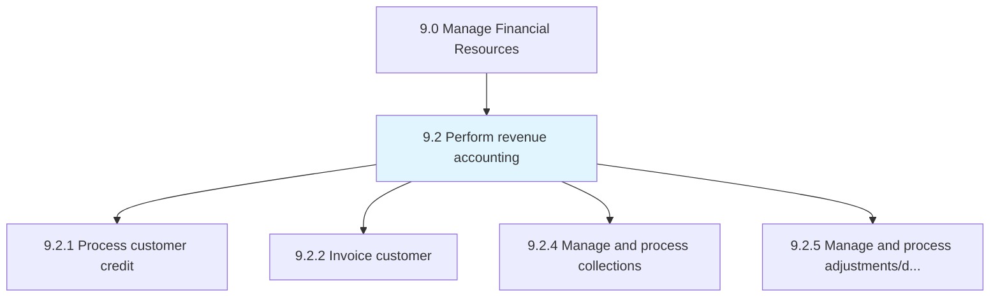
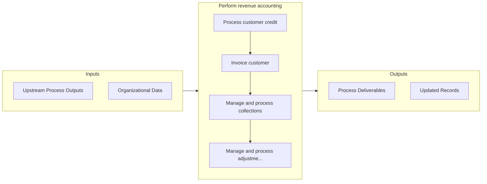

# Perform revenue accounting

> Comparing revenue targets to reality.

## Overview

Group 9.2 is a process group within APQC Category 9.0 (Manage Financial Resources). 

Comparing revenue targets to reality. Review all transactions and entries passed in final accounts in a year in order to examine profits.

## Process Hierarchy



## Key Statistics

| Metric | Value |
|--------|-------|
| APQC Code | 10729 |
| Hierarchy ID | 9.2 |
| Level | Group |
| Parent | [9](../) |
| Sub-Processes | 4 |


## GraphDL Semantic Structure

```
perform.RevenueAccounting
```

| Component | Value | Description |
|-----------|-------|-------------|
| Verb | `perform` | Primary action |
| Object | `revenue accounting` | Direct object |


## Process Flow



## Sub-Processes

| Process | Hierarchy ID | Description |
|---------|-------------|-------------|
| [Process customer credit](./9.2.1-ProcessCustomerCredit/) | 9.2.1 | Evaluating and processing requests for advances |
| [Invoice customer](./9.2.2-InvoiceCustomer/) | 9.2.2 | Preparing detailed reports of customer purchases |
| [Manage and process collections](./9.2.4-ManageProcessCollections/) | 9.2.4 | Posting entries to respective accounts, and preparing accounts for receivables |
| [Manage and process adjustments/deductions](./9.2.5-ManageProcessAdjustmentsdeductions/) | 9.2.5 | Creating and providing funds for necessary adjustments and deductions, including all expenses that w |


## Related Concepts

- [RevenueAccounting](/concepts/RevenueAccounting)


---

*Source: APQC PCF 10729 (9.2) - APQC*
