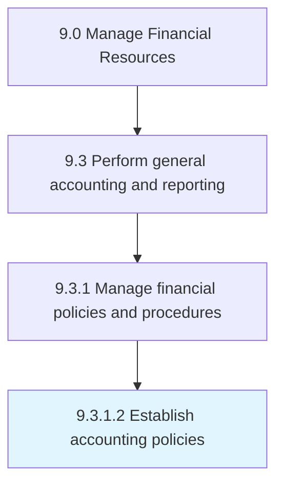

# Establish accounting policies

> Establishing policies and procedures to prepare financial statements, including methods, measurement systems, and procedures for providing disclosures.

## Overview

Activity 9.3.1.2 is an activity within the Manage Financial Resources framework. 

Establishing policies and procedures to prepare financial statements, including methods, measurement systems, and procedures for providing disclosures.

## Process Hierarchy



## Key Statistics

| Metric | Value |
|--------|-------|
| APQC Code | 10816 |
| Hierarchy ID | 9.3.1.2 |
| Level | Activity |
| Parent | [9.3.1](../) |
| Sub-Processes | 0 |


## GraphDL Semantic Structure

```
establish.AccountingPolicies
```

| Component | Value | Description |
|-----------|-------|-------------|
| Verb | `establish` | Primary action |
| Object | `accounting policies` | Direct object |


## Related Concepts

- [AccountingPolicies](/concepts/AccountingPolicies)


---

*Source: APQC PCF 10816 (9.3.1.2) - APQC*
