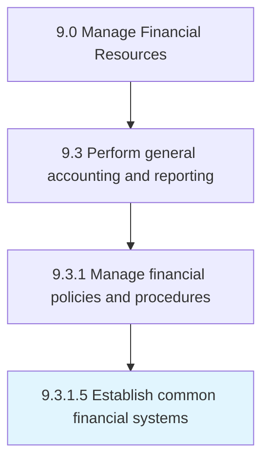

# Establish common financial systems

> Establishing processes and procedures to exercise financial control and accountability.

## Overview

Activity 9.3.1.5 is an activity within the Manage Financial Resources framework. 

Establishing processes and procedures to exercise financial control and accountability. Record, verify, and report transactions that affect revenues, expenditures, assets, and liabilities.

## Process Hierarchy



## Key Statistics

| Metric | Value |
|--------|-------|
| APQC Code | 10818 |
| Hierarchy ID | 9.3.1.5 |
| Level | Activity |
| Parent | [9.3.1](../) |
| Sub-Processes | 0 |


## GraphDL Semantic Structure

```
establish.CommonFinancialSystems
```

| Component | Value | Description |
|-----------|-------|-------------|
| Verb | `establish` | Primary action |
| Object | `common financial systems` | Direct object |


## Related Concepts

- [CommonFinancialSystems](/concepts/CommonFinancialSystems)


---

*Source: APQC PCF 10818 (9.3.1.5) - APQC*
