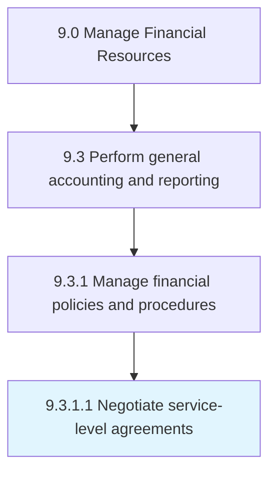

# Negotiate service-level agreements

> Agreeing upon terms and conditions.

## Overview

Activity 9.3.1.1 is an activity within the Manage Financial Resources framework. 

Agreeing upon terms and conditions. Negotiate an agreement between two or more parties, the customer and service providers. Specify scope, quality, and responsibilities.

## Process Hierarchy



## Key Statistics

| Metric | Value |
|--------|-------|
| APQC Code | 10815 |
| Hierarchy ID | 9.3.1.1 |
| Level | Activity |
| Parent | [9.3.1](../) |
| Sub-Processes | 0 |


## GraphDL Semantic Structure

```
negotiate.ServicelevelAgreements
```

| Component | Value | Description |
|-----------|-------|-------------|
| Verb | `negotiate` | Primary action |
| Object | `service-level agreements` | Direct object |


---

*Source: APQC PCF 10815 (9.3.1.1) - APQC*
