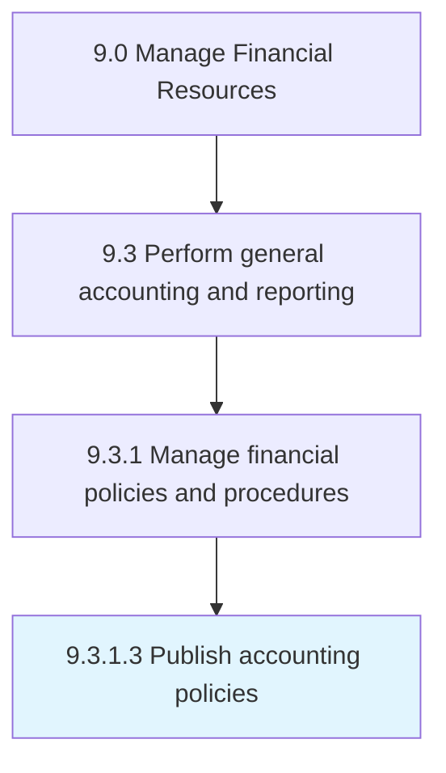

# Publish accounting policies

> Creating a written copy of agreed-upon procedures for preparing financial statements, and making them available to the public.

## Overview

Activity 9.3.1.3 is an activity within the Manage Financial Resources framework. 

Creating a written copy of agreed-upon procedures for preparing financial statements, and making them available to the public.

## Process Hierarchy



## Key Statistics

| Metric | Value |
|--------|-------|
| APQC Code | 20604 |
| Hierarchy ID | 9.3.1.3 |
| Level | Activity |
| Parent | [9.3.1](../) |
| Sub-Processes | 0 |


## GraphDL Semantic Structure

```
publish.AccountingPolicies
```

| Component | Value | Description |
|-----------|-------|-------------|
| Verb | `publish` | Primary action |
| Object | `accounting policies` | Direct object |


## Related Concepts

- AccountingPolicies


---

*Source: APQC PCF 20604 (9.3.1.3) - APQC*
