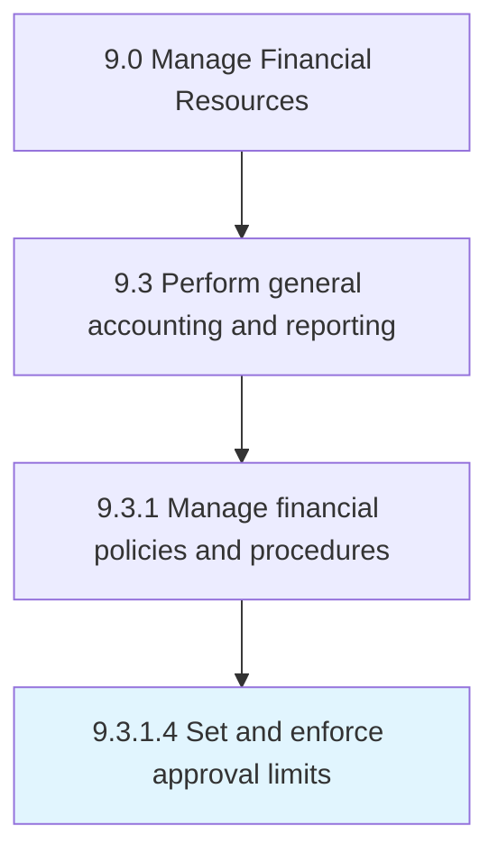

# Set and enforce approval limits

> Implementing parameters for accounting.

## Overview

Activity 9.3.1.4 is an activity within the Manage Financial Resources framework. 

Implementing parameters for accounting. Apply set conditions for any approval process.

## Process Hierarchy



## Key Statistics

| Metric | Value |
|--------|-------|
| APQC Code | 10817 |
| Hierarchy ID | 9.3.1.4 |
| Level | Activity |
| Parent | [9.3.1](../) |
| Sub-Processes | 0 |


## GraphDL Semantic Structure

```
set.AndEnforceApprovalLimits
```

| Component | Value | Description |
|-----------|-------|-------------|
| Verb | `set` | Primary action |
| Object | `and enforce approval limits` | Direct object |


## Related Concepts

- ApprovalLimits
- ApprovalLimits


---

*Source: APQC PCF 10817 (9.3.1.4) - APQC*
