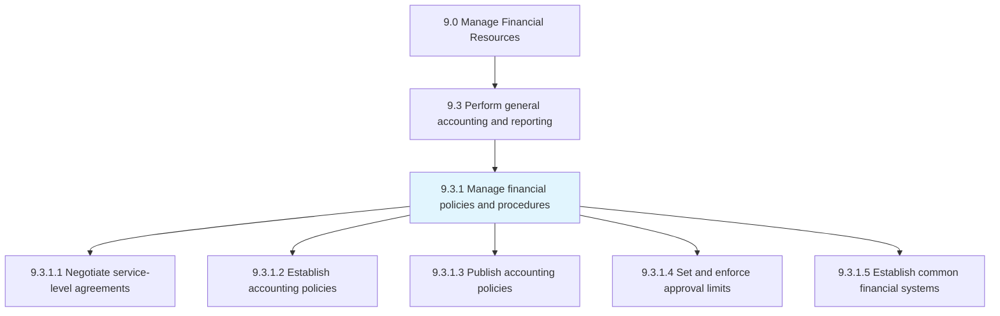
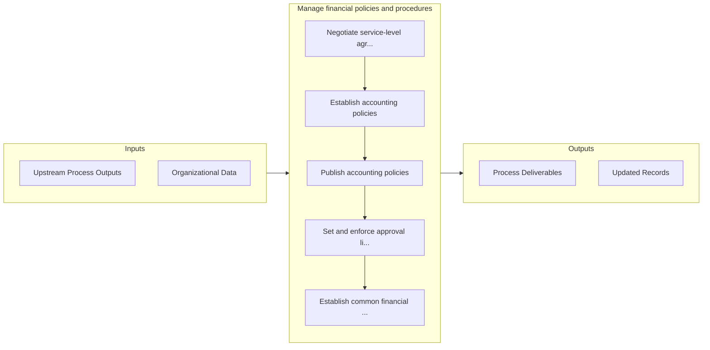

# Manage financial policies and procedures

> Creating procedures to perform general accounting and reporting.

## Overview

Process 9.3.1 is a core process that defines the specific procedures for manage financial policies and procedures. 

Creating procedures to perform general accounting and reporting. Follow the rules and regulations made for a particular process in the business. Publish accounting policies.

## Process Hierarchy



## Key Statistics

| Metric | Value |
|--------|-------|
| APQC Code | 10747 |
| Hierarchy ID | 9.3.1 |
| Level | Process |
| Parent | [9.3](../) |
| Sub-Processes | 5 |


## GraphDL Semantic Structure

```
manage.FinancialPoliciesAndProcedures
```

| Component | Value | Description |
|-----------|-------|-------------|
| Verb | `manage` | Primary action |
| Object | `financial policies and procedures` | Direct object |


## Process Flow



## Sub-Processes

| Process | Hierarchy ID | Description |
|---------|-------------|-------------|
| [Negotiate service-level agreements](./NegotiateServicelevelAgreements) | 9.3.1.1 | Agreeing upon terms and conditions |
| [Establish accounting policies](./EstablishAccountingPolicies) | 9.3.1.2 | Establishing policies and procedures to prepare financial statements, including methods, measurement |
| [Publish accounting policies](./PublishAccountingPolicies) | 9.3.1.3 | Creating a written copy of agreed-upon procedures for preparing financial statements, and making the |
| [Set and enforce approval limits](./SetAndEnforceApprovalLimits) | 9.3.1.4 | Implementing parameters for accounting |
| [Establish common financial systems](./EstablishCommonFinancialSystems) | 9.3.1.5 | Establishing processes and procedures to exercise financial control and accountability |


## Related Concepts

- FinancialPolicies
- Procedures


---

*Source: APQC PCF 10747 (9.3.1) - APQC*
