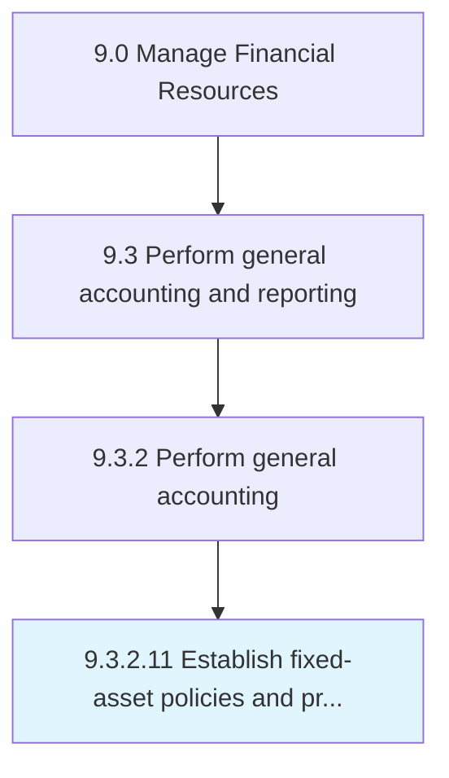

# Establish fixed-asset policies and procedures

> Creating rules for fixed assets market valuation.

## Overview

Activity 9.3.2.11 is an activity within the Manage Financial Resources framework. 

Creating rules for fixed assets market valuation. Make rules and regulations for fixed assets regarding depreciation, provisions, resale, usage, etc.

## Process Hierarchy



## Key Statistics

| Metric | Value |
|--------|-------|
| APQC Code | 10828 |
| Hierarchy ID | 9.3.2.11 |
| Level | Activity |
| Parent | [9.3.2](../) |
| Sub-Processes | 0 |


## GraphDL Semantic Structure

```
establish.FixedassetPoliciesAndProcedures
```

| Component | Value | Description |
|-----------|-------|-------------|
| Verb | `establish` | Primary action |
| Object | `fixed-asset policies and procedures` | Direct object |


---

*Source: APQC PCF 10828 (9.3.2.11) - APQC*
