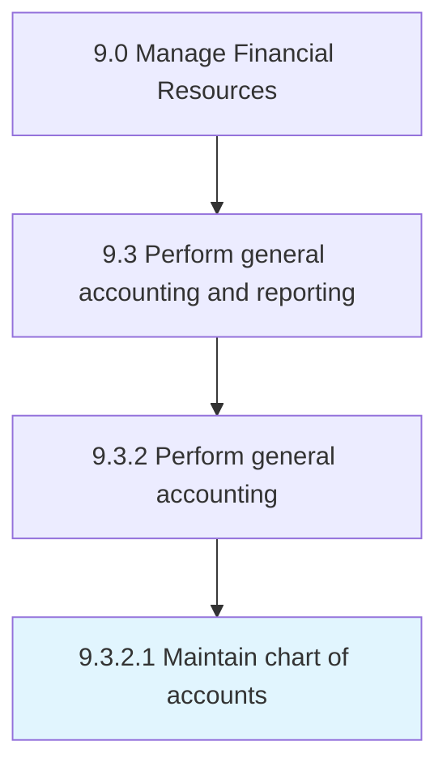

# Maintain chart of accounts

> Preparing trial balance account from general ledgers.

## Overview

Activity 9.3.2.1 is an activity within the Manage Financial Resources framework. 

Preparing trial balance account from general ledgers. List all accounts used in the general ledger. Alter accounts according to business requirements.

## Process Hierarchy



## Key Statistics

| Metric | Value |
|--------|-------|
| APQC Code | 10819 |
| Hierarchy ID | 9.3.2.1 |
| Level | Activity |
| Parent | [9.3.2](../) |
| Sub-Processes | 0 |


## GraphDL Semantic Structure

```
maintain.Chart.of.Accounts
```

| Component | Value | Description |
|-----------|-------|-------------|
| Verb | `maintain` | Primary action |
| Object | `chart` | Direct object |
| Preposition | `of` | Relationship |
| PrepObject | `accounts` | Indirect object |


## Related Concepts

- [Chart](/concepts/Chart)
- [Accounts](/concepts/Accounts)


---

*Source: APQC PCF 10819 (9.3.2.1) - APQC*
