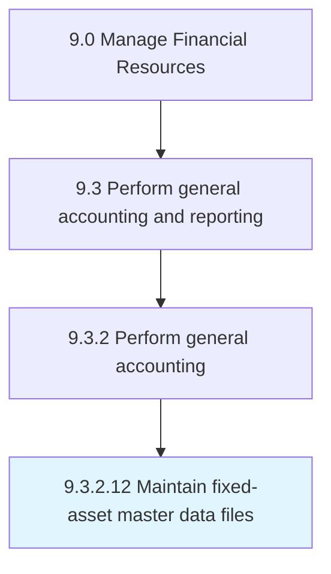

# Maintain fixed-asset master data files

> Keeping reports up-to-date regarding fixed assets.

## Overview

Activity 9.3.2.12 is an activity within the Manage Financial Resources framework. 

Keeping reports up-to-date regarding fixed assets. Create a fixed assets database detailing price, life cycle, depreciation rate, resale value, installation information, usage information, etc.

## Process Hierarchy



## Key Statistics

| Metric | Value |
|--------|-------|
| APQC Code | 10829 |
| Hierarchy ID | 9.3.2.12 |
| Level | Activity |
| Parent | [9.3.2](../) |
| Sub-Processes | 0 |


## GraphDL Semantic Structure

```
maintain.FixedassetMasterDataFiles
```

| Component | Value | Description |
|-----------|-------|-------------|
| Verb | `maintain` | Primary action |
| Object | `fixed-asset master data files` | Direct object |


---

*Source: APQC PCF 10829 (9.3.2.12) - APQC*
