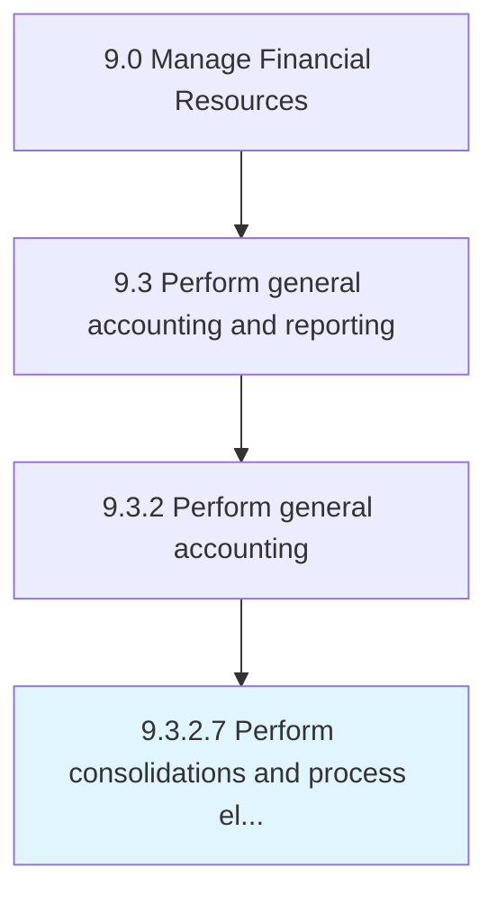

# Perform consolidations and process eliminations

> Aggregating different processes in the business.

## Overview

Activity 9.3.2.7 is an activity within the Manage Financial Resources framework. 

Aggregating different processes in the business. Eliminate discontinued processes.

## Process Hierarchy



## Key Statistics

| Metric | Value |
|--------|-------|
| APQC Code | 10825 |
| Hierarchy ID | 9.3.2.7 |
| Level | Activity |
| Parent | [9.3.2](../) |
| Sub-Processes | 0 |


## GraphDL Semantic Structure

```
perform.ConsolidationsAndProcessEliminations
```

| Component | Value | Description |
|-----------|-------|-------------|
| Verb | `perform` | Primary action |
| Object | `consolidations and process eliminations` | Direct object |


## Related Concepts

- Consolidations
- ProcessEliminations


---

*Source: APQC PCF 10825 (9.3.2.7) - APQC*
