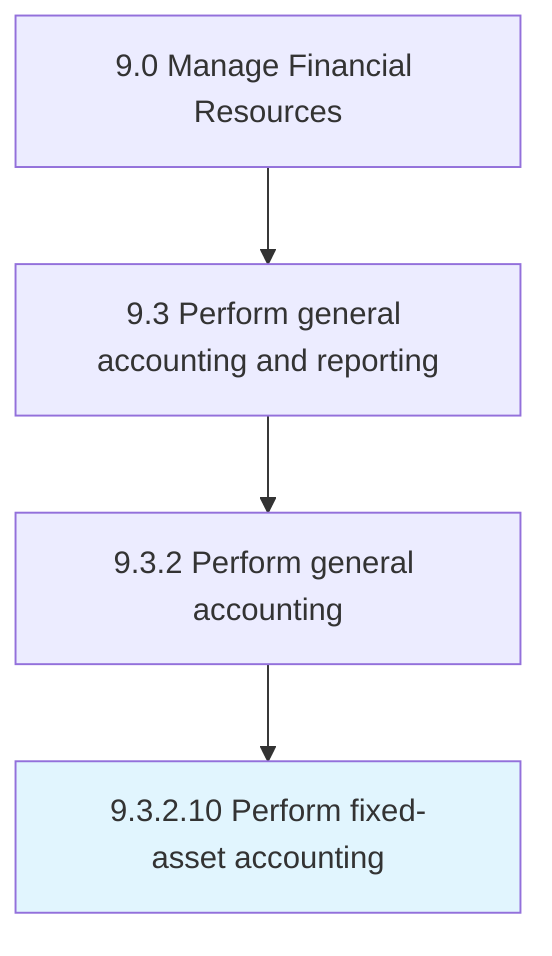

# Perform fixed-asset accounting

> Accounting for long-term and fixed assets.

## Overview

Activity 9.3.2.10 is an activity within the Manage Financial Resources framework. 

Accounting for long-term and fixed assets. Record purchased, fixed assets that are not easily convertible into cash. Account for costs, useful life, resale value, depreciation, and amortization.

## Process Hierarchy



## Key Statistics

| Metric | Value |
|--------|-------|
| APQC Code | 10749 |
| Hierarchy ID | 9.3.2.10 |
| Level | Activity |
| Parent | [9.3.2](../) |
| Sub-Processes | 0 |


## GraphDL Semantic Structure

```
perform.FixedassetAccounting
```

| Component | Value | Description |
|-----------|-------|-------------|
| Verb | `perform` | Primary action |
| Object | `fixed-asset accounting` | Direct object |


---

*Source: APQC PCF 10749 (9.3.2.10) - APQC*
