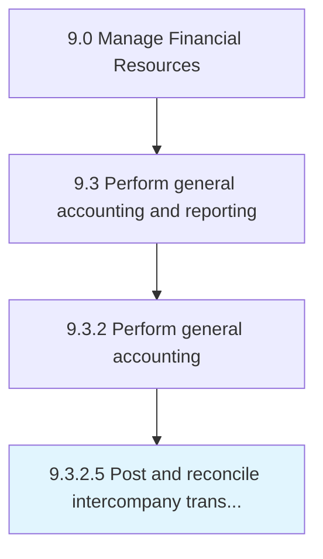

# Post and reconcile intercompany transactions

> Checking accounts separately for a parent and subsidiary company.

## Overview

Activity 9.3.2.5 is an activity within the Manage Financial Resources framework. 

Checking accounts separately for a parent and subsidiary company. Manage relationship between a parent company and subsidiaries. Document intercompany transactions in separate financial statements.

## Process Hierarchy



## Key Statistics

| Metric | Value |
|--------|-------|
| APQC Code | 10823 |
| Hierarchy ID | 9.3.2.5 |
| Level | Activity |
| Parent | [9.3.2](../) |
| Sub-Processes | 0 |


## GraphDL Semantic Structure

```
post.AndReconcileIntercompanyTransactions
```

| Component | Value | Description |
|-----------|-------|-------------|
| Verb | `post` | Primary action |
| Object | `and reconcile intercompany transactions` | Direct object |


## Related Concepts

- [IntercompanyTransactions](/concepts/IntercompanyTransactions)
- [IntercompanyTransactions](/concepts/IntercompanyTransactions)


---

*Source: APQC PCF 10823 (9.3.2.5) - APQC*
