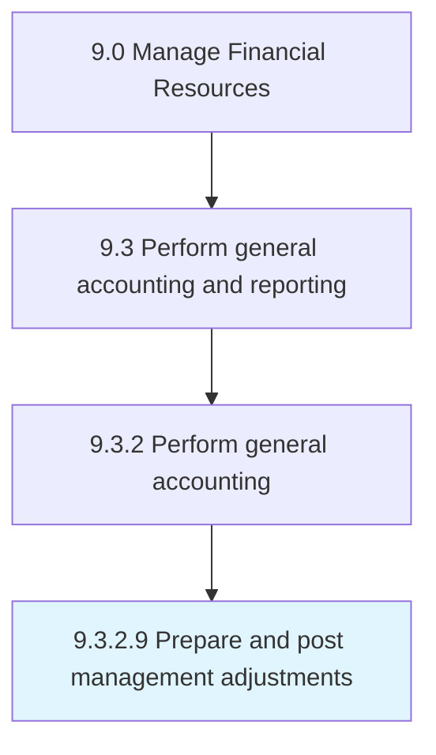

# Prepare and post management adjustments

> Accounting for changes due to country-level policy changes.

## Overview

Activity 9.3.2.9 is an activity within the Manage Financial Resources framework. 

Accounting for changes due to country-level policy changes. Record adjustments made by management in the accounts.

## Process Hierarchy



## Key Statistics

| Metric | Value |
|--------|-------|
| APQC Code | 10827 |
| Hierarchy ID | 9.3.2.9 |
| Level | Activity |
| Parent | [9.3.2](../) |
| Sub-Processes | 0 |


## GraphDL Semantic Structure

```
prepare.AndPostManagementAdjustments
```

| Component | Value | Description |
|-----------|-------|-------------|
| Verb | `prepare` | Primary action |
| Object | `and post management adjustments` | Direct object |


## Related Concepts

- ManagementAdjustments
- ManagementAdjustments


---

*Source: APQC PCF 10827 (9.3.2.9) - APQC*
