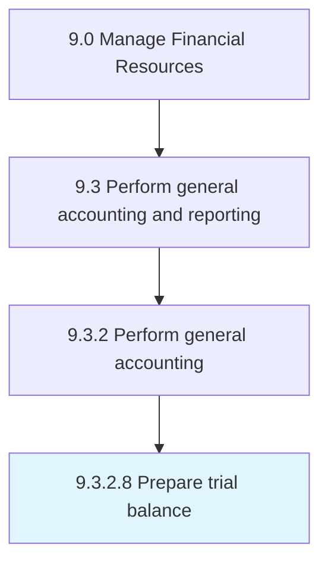

# Prepare trial balance

> Balancing debit and credit balances of trial balance to preparing final accounts.

## Overview

Activity 9.3.2.8 is an activity within the Manage Financial Resources framework. 

Balancing debit and credit balances of trial balance to preparing final accounts. Calculate the total debits and credits in company's accounts. Correspond the sum of all debits with the sum of all credits. Adjust entries as appropriate.

## Process Hierarchy



## Key Statistics

| Metric | Value |
|--------|-------|
| APQC Code | 10826 |
| Hierarchy ID | 9.3.2.8 |
| Level | Activity |
| Parent | [9.3.2](../) |
| Sub-Processes | 0 |


## GraphDL Semantic Structure

```
prepare.TrialBalance
```

| Component | Value | Description |
|-----------|-------|-------------|
| Verb | `prepare` | Primary action |
| Object | `trial balance` | Direct object |


## Related Concepts

- TrialBalance


---

*Source: APQC PCF 10826 (9.3.2.8) - APQC*
