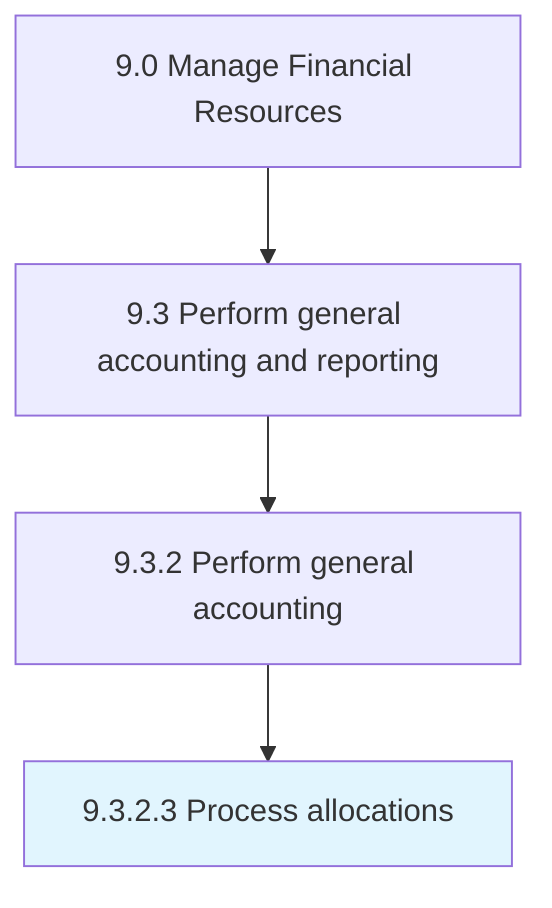

# Process allocations

> Allocating funds across functions.

## Overview

Activity 9.3.2.3 is an activity within the Manage Financial Resources framework. 

Allocating funds across functions. Apportion funds in line with the budgets created. Formalize allocations in centralized internal records.

## Process Hierarchy



## Key Statistics

| Metric | Value |
|--------|-------|
| APQC Code | 10821 |
| Hierarchy ID | 9.3.2.3 |
| Level | Activity |
| Parent | [9.3.2](../) |
| Sub-Processes | 0 |


## GraphDL Semantic Structure

```
process.Allocations
```

| Component | Value | Description |
|-----------|-------|-------------|
| Verb | `process` | Primary action |
| Object | `allocations` | Direct object |


## Related Concepts

- Allocations


---

*Source: APQC PCF 10821 (9.3.2.3) - APQC*
