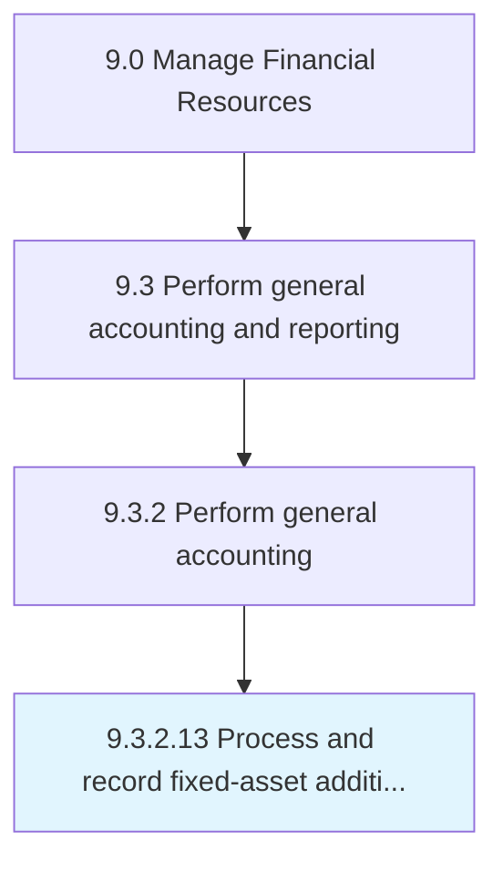

# Process and record fixed-asset additions and retires

> Keeping a summary of sales and purchases of assets.

## Overview

Activity 9.3.2.13 is an activity within the Manage Financial Resources framework. 

Keeping a summary of sales and purchases of assets. Record any expenses made for new assets purchased and sales of any old assets during the fiscal year.

## Process Hierarchy



## Key Statistics

| Metric | Value |
|--------|-------|
| APQC Code | 10830 |
| Hierarchy ID | 9.3.2.13 |
| Level | Activity |
| Parent | [9.3.2](../) |
| Sub-Processes | 0 |


## GraphDL Semantic Structure

```
process.AndRecordFixedassetAdditionsAndRetires
```

| Component | Value | Description |
|-----------|-------|-------------|
| Verb | `process` | Primary action |
| Object | `and record fixed-asset additions and retires` | Direct object |


---

*Source: APQC PCF 10830 (9.3.2.13) - APQC*
