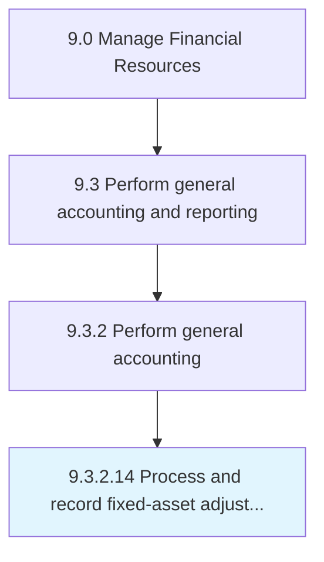

# Process and record fixed-asset adjustments, enhancements, revaluations, and transfers

> Keeping a summary of expenses for installing and modifying assets.

## Overview

Activity 9.3.2.14 is an activity within the Manage Financial Resources framework. 

Keeping a summary of expenses for installing and modifying assets. Record any expenses made for new assets purchased, any expenses incurred on improvements, the valuation of assets to reach current market price, and any transfer assets from one location to another during the fiscal year.

## Process Hierarchy



## Key Statistics

| Metric | Value |
|--------|-------|
| APQC Code | 10831 |
| Hierarchy ID | 9.3.2.14 |
| Level | Activity |
| Parent | [9.3.2](../) |
| Sub-Processes | 0 |


## GraphDL Semantic Structure

```
process.AndRecordFixedassetAdjustmentsEnhancementsRevaluationsAndTransfers
```

| Component | Value | Description |
|-----------|-------|-------------|
| Verb | `process` | Primary action |
| Object | `and record fixed-asset adjustments, enhancements, revaluations, and transfers` | Direct object |


---

*Source: APQC PCF 10831 (9.3.2.14) - APQC*
