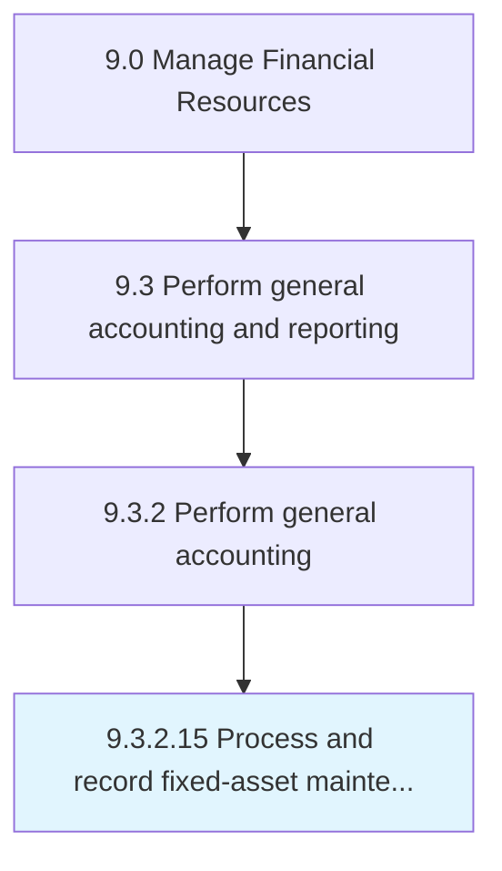

# Process and record fixed-asset maintenance and repair expenses

> Maintaining a record of expenses necessitated for repairs and the preservation of assets.

## Overview

Activity 9.3.2.15 is an activity within the Manage Financial Resources framework. 

Maintaining a record of expenses necessitated for repairs and the preservation of assets. Administer and oversee the maintenance and repair of any fixed assets. Record all related transactions.

## Process Hierarchy



## Key Statistics

| Metric | Value |
|--------|-------|
| APQC Code | 10832 |
| Hierarchy ID | 9.3.2.15 |
| Level | Activity |
| Parent | [9.3.2](../) |
| Sub-Processes | 0 |


## GraphDL Semantic Structure

```
process.AndRecordFixedassetMaintenanceAndRepairExpenses
```

| Component | Value | Description |
|-----------|-------|-------------|
| Verb | `process` | Primary action |
| Object | `and record fixed-asset maintenance and repair expenses` | Direct object |


---

*Source: APQC PCF 10832 (9.3.2.15) - APQC*
