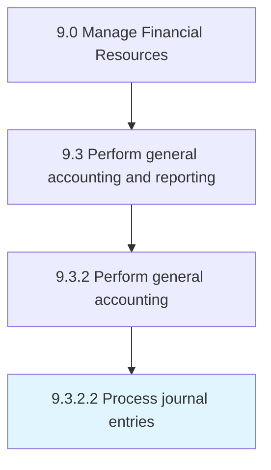

# Process journal entries

> Making ledger and trial balance accounts from journal entries.

## Overview

Activity 9.3.2.2 is an activity within the Manage Financial Resources framework. 

Making ledger and trial balance accounts from journal entries. This process requires the organization to record every transaction into accounts done by business. It is a base documents for preparing final accounts of company.

## Process Hierarchy



## Key Statistics

| Metric | Value |
|--------|-------|
| APQC Code | 10820 |
| Hierarchy ID | 9.3.2.2 |
| Level | Activity |
| Parent | [9.3.2](../) |
| Sub-Processes | 0 |


## GraphDL Semantic Structure

```
process.JournalEntries
```

| Component | Value | Description |
|-----------|-------|-------------|
| Verb | `process` | Primary action |
| Object | `journal entries` | Direct object |


## Related Concepts

- JournalEntries


---

*Source: APQC PCF 10820 (9.3.2.2) - APQC*
