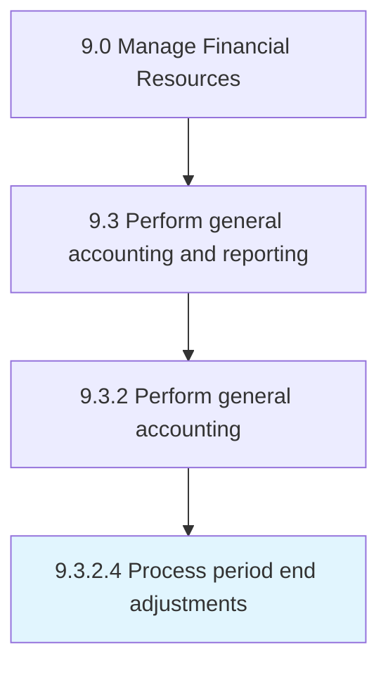

# Process period end adjustments

> Updating journal entries to adjust the balance of income and expenses at the end of an accounting period.

## Overview

Activity 9.3.2.4 is an activity within the Manage Financial Resources framework. 

Updating journal entries to adjust the balance of income and expenses at the end of an accounting period.

## Process Hierarchy



## Key Statistics

| Metric | Value |
|--------|-------|
| APQC Code | 10822 |
| Hierarchy ID | 9.3.2.4 |
| Level | Activity |
| Parent | [9.3.2](../) |
| Sub-Processes | 0 |


## GraphDL Semantic Structure

```
process.PeriodEndAdjustments
```

| Component | Value | Description |
|-----------|-------|-------------|
| Verb | `process` | Primary action |
| Object | `period end adjustments` | Direct object |


## Related Concepts

- [PeriodEndAdjustments](/concepts/PeriodEndAdjustments)


---

*Source: APQC PCF 10822 (9.3.2.4) - APQC*
