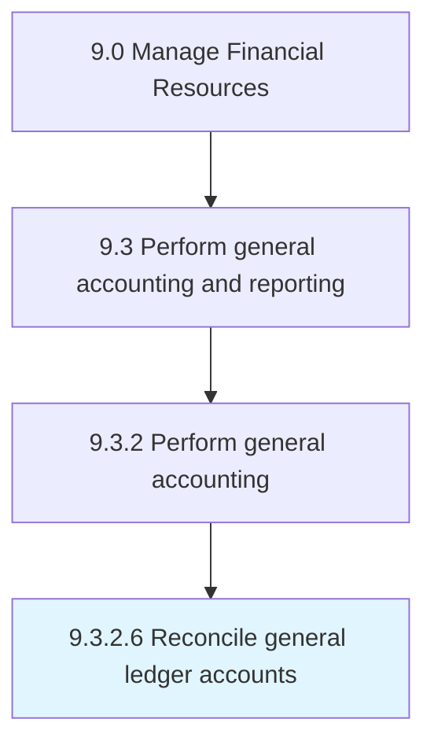

# Reconcile general ledger accounts

> Reviewing general ledger accounts for a parent and subsidiaries companies.

## Overview

Activity 9.3.2.6 is an activity within the Manage Financial Resources framework. 

Reviewing general ledger accounts for a parent and subsidiaries companies. Validate the integrity of account balances on the company's general ledger of accounts. Review and compare general ledger accounts balances with source documents to ensure that balances match.

## Process Hierarchy



## Key Statistics

| Metric | Value |
|--------|-------|
| APQC Code | 10824 |
| Hierarchy ID | 9.3.2.6 |
| Level | Activity |
| Parent | [9.3.2](../) |
| Sub-Processes | 0 |


## GraphDL Semantic Structure

```
reconcile.GeneralLedgerAccounts
```

| Component | Value | Description |
|-----------|-------|-------------|
| Verb | `reconcile` | Primary action |
| Object | `general ledger accounts` | Direct object |


## Related Concepts

- GeneralLedgerAccounts


---

*Source: APQC PCF 10824 (9.3.2.6) - APQC*
