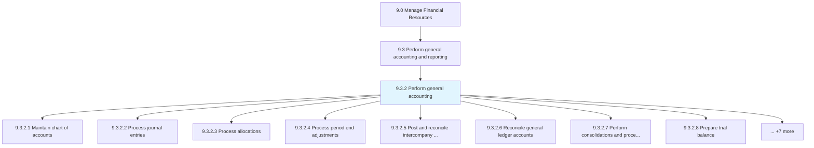
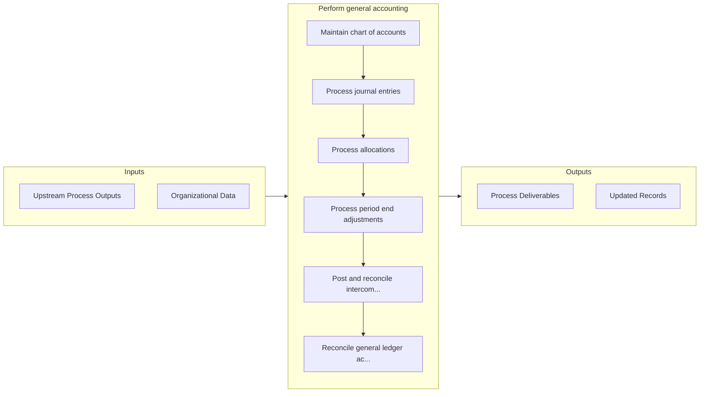

# Perform general accounting

> Applying basic principles, concepts, and accounting practices in recording and preparing final accounts, and using accounting information in management.

## Overview

Process 9.3.2 is a core process that defines the specific procedures for perform general accounting. 

Applying basic principles, concepts, and accounting practices in recording and preparing final accounts, and using accounting information in management.

## Process Hierarchy



## Key Statistics

| Metric | Value |
|--------|-------|
| APQC Code | 10748 |
| Hierarchy ID | 9.3.2 |
| Level | Process |
| Parent | [9.3](../) |
| Sub-Processes | 15 |


## GraphDL Semantic Structure

```graphdl
perform.GeneralAccounting
```

| Component | Value | Description |
|-----------|-------|-------------|
| Verb | `perform` | Primary action |
| Object | `general accounting` | Direct object |


## Process Flow



## Sub-Processes

| Process | Hierarchy ID | Description |
|---------|-------------|-------------|
| [Maintain chart of accounts](./MaintainChartOfAccounts) | 9.3.2.1 | Preparing trial balance account from general ledgers |
| [Process journal entries](./ProcessJournalEntries) | 9.3.2.2 | Making ledger and trial balance accounts from journal entries |
| [Process allocations](./ProcessAllocations) | 9.3.2.3 | Allocating funds across functions |
| [Process period end adjustments](./ProcessPeriodEndAdjustments) | 9.3.2.4 | Updating journal entries to adjust the balance of income and expenses at the end of an accounting pe |
| [Post and reconcile intercompany transactions](./PostAndReconcileIntercompanyTransactions) | 9.3.2.5 | Checking accounts separately for a parent and subsidiary company |
| [Reconcile general ledger accounts](./ReconcileGeneralLedgerAccounts) | 9.3.2.6 | Reviewing general ledger accounts for a parent and subsidiaries companies |
| [Perform consolidations and process eliminations](./PerformConsolidationsAndProcessEliminations) | 9.3.2.7 | Aggregating different processes in the business |
| [Prepare trial balance](./PrepareTrialBalance) | 9.3.2.8 | Balancing debit and credit balances of trial balance to preparing final accounts |
| [Prepare and post management adjustments](./PrepareAndPostManagementAdjustments) | 9.3.2.9 | Accounting for changes due to country-level policy changes |
| [Perform fixed-asset accounting](./PerformFixedassetAccounting) | 9.3.2.10 | Accounting for long-term and fixed assets |
| [Establish fixed-asset policies and procedures](./EstablishFixedassetPoliciesAndProcedures) | 9.3.2.11 | Creating rules for fixed assets market valuation |
| [Maintain fixed-asset master data files](./MaintainFixedassetMasterDataFiles) | 9.3.2.12 | Keeping reports up-to-date regarding fixed assets |
| [Process and record fixed-asset additions and retires](./ProcessAndRecordFixedassetAdditionsAndRetires) | 9.3.2.13 | Keeping a summary of sales and purchases of assets |
| [Process and record fixed-asset adjustments, enhancements, revaluations, and transfers](./ProcessAndRecordFixedassetAdjustmentsEnhancementsRevaluationsAndTransfers) | 9.3.2.14 | Keeping a summary of expenses for installing and modifying assets |
| [Process and record fixed-asset maintenance and repair expenses](./ProcessAndRecordFixedassetMaintenanceAndRepairExpenses) | 9.3.2.15 | Maintaining a record of expenses necessitated for repairs and the preservation of assets |


## Related Concepts

- GeneralAccounting


---

*Source: APQC PCF 10748 (9.3.2) - APQC*
