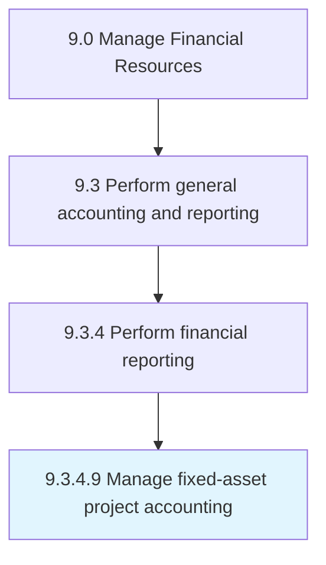

# Manage fixed-asset project accounting

> Managing accounts for large funds-invested projects.

## Overview

Activity 9.3.4.9 is an activity within the Manage Financial Resources framework. 

Managing accounts for large funds-invested projects. Manage and account for fixed assets projects (capital projects), which required significant capital investments over many years.

## Process Hierarchy



## Key Statistics

| Metric | Value |
|--------|-------|
| APQC Code | 10731 |
| Hierarchy ID | 9.3.4.9 |
| Level | Activity |
| Parent | [9.3.4](../) |
| Sub-Processes | 0 |


## GraphDL Semantic Structure

```
manage.FixedassetProjectAccounting
```

| Component | Value | Description |
|-----------|-------|-------------|
| Verb | `manage` | Primary action |
| Object | `fixed-asset project accounting` | Direct object |


---

*Source: APQC PCF 10731 (9.3.4.9) - APQC*
