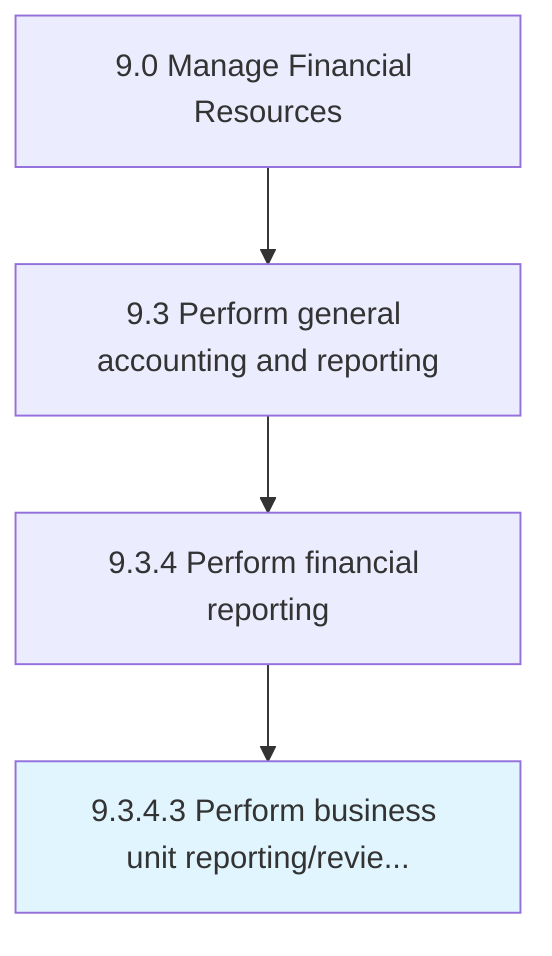

# Perform business unit reporting/review management reports

> Making reports for units/subsidiaries to help management in decision making.

## Overview

Activity 9.3.4.3 is an activity within the Manage Financial Resources framework. 

Making reports for units/subsidiaries to help management in decision making. Prepare financial statements (balance sheets, income statements, cash flow statements, and statements of shareholders' equity) for a single unit of a business. Break down profits and losses by function/unit, clients, products, and region.

## Process Hierarchy



## Key Statistics

| Metric | Value |
|--------|-------|
| APQC Code | 10839 |
| Hierarchy ID | 9.3.4.3 |
| Level | Activity |
| Parent | [9.3.4](../) |
| Sub-Processes | 0 |


## GraphDL Semantic Structure

```
perform.BusinessUnitReportingreviewManagementReports
```

| Component | Value | Description |
|-----------|-------|-------------|
| Verb | `perform` | Primary action |
| Object | `business unit reporting/review management reports` | Direct object |


## Related Concepts

- BusinessUnitReportingManagementReports
- BusinessUnitReviewManagementReports


---

*Source: APQC PCF 10839 (9.3.4.3) - APQC*
