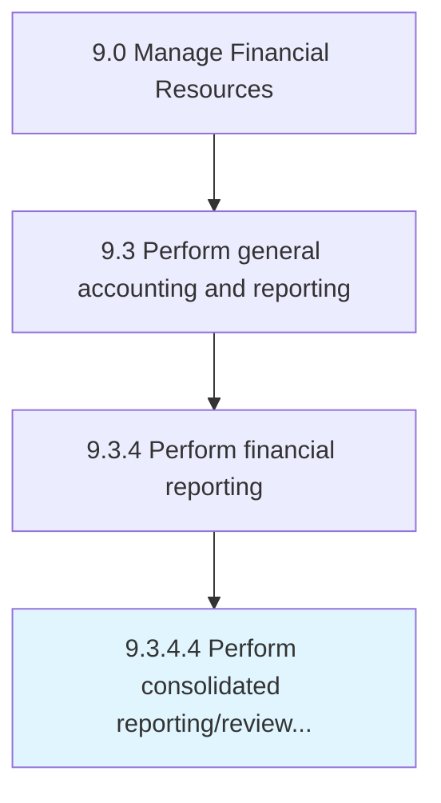

# Perform consolidated reporting/review of cost management reports

> Making reports for all units to help higher management in decision making.

## Overview

Activity 9.3.4.4 is an activity within the Manage Financial Resources framework. 

Making reports for all units to help higher management in decision making. Prepare combined financial statements of a parent company and its all subsidiaries (separate legal entities controlled by a parent company) showing assets, liabilities, equity, income, expenses and cash flows, and also going through periodic reports which shows the actual and estimated costs and their variances.

## Process Hierarchy



## Key Statistics

| Metric | Value |
|--------|-------|
| APQC Code | 10840 |
| Hierarchy ID | 9.3.4.4 |
| Level | Activity |
| Parent | [9.3.4](../) |
| Sub-Processes | 0 |


## GraphDL Semantic Structure

```
perform.ConsolidatedReportingreview.of.CostManagementReports
```

| Component | Value | Description |
|-----------|-------|-------------|
| Verb | `perform` | Primary action |
| Object | `consolidated reporting/review` | Direct object |
| Preposition | `of` | Relationship |
| PrepObject | `cost management reports` | Indirect object |


## Related Concepts

- ConsolidatedReporting
- CostManagementReports
- ConsolidatedReview
- CostManagementReports


---

*Source: APQC PCF 10840 (9.3.4.4) - APQC*
