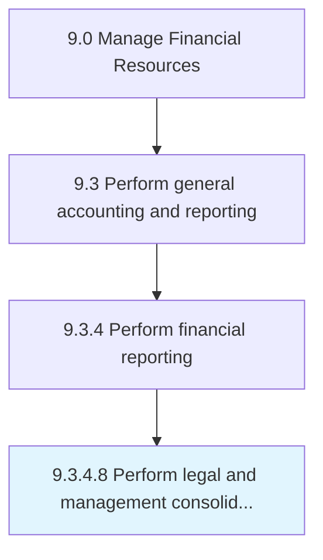

# Perform legal and management consolidation

> Carrying out activities associated with legal and management consolidation.

## Overview

Activity 9.3.4.8 is an activity within the Manage Financial Resources framework. 

Carrying out activities associated with legal and management consolidation. Legal consolidation can include currency conversion, balance carry forward, and consolidation of journal entries. Management consolidation can include reporting on financials on a reporting cycle basis to gauge the performance of the organization.

## Process Hierarchy



## Key Statistics

| Metric | Value |
|--------|-------|
| APQC Code | 14074 |
| Hierarchy ID | 9.3.4.8 |
| Level | Activity |
| Parent | [9.3.4](../) |
| Sub-Processes | 0 |


## GraphDL Semantic Structure

```
perform.LegalAndManagementConsolidation
```

| Component | Value | Description |
|-----------|-------|-------------|
| Verb | `perform` | Primary action |
| Object | `legal and management consolidation` | Direct object |


## Related Concepts

- LegalConsolidation
- ManagementConsolidation


---

*Source: APQC PCF 14074 (9.3.4.8) - APQC*
